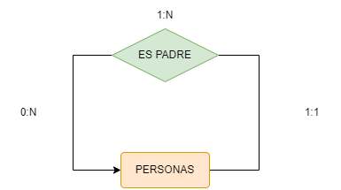
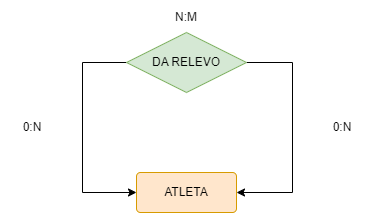
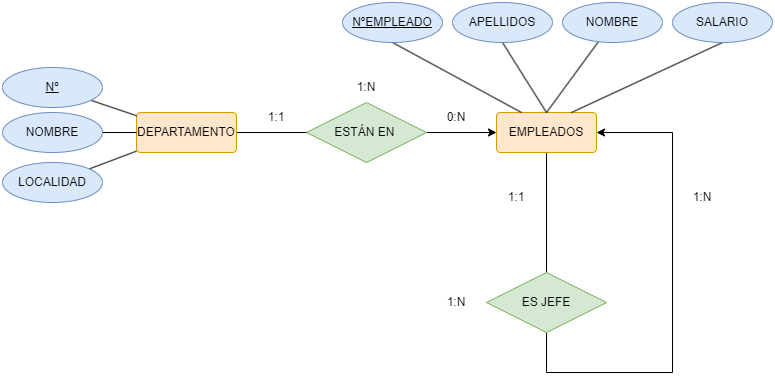
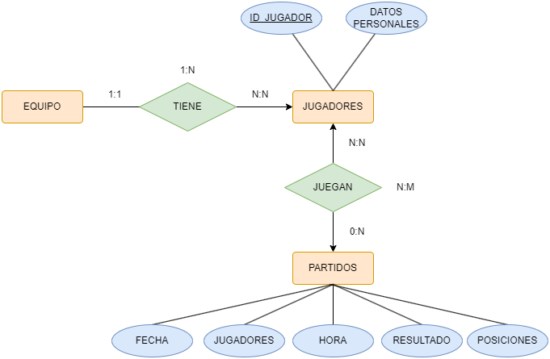
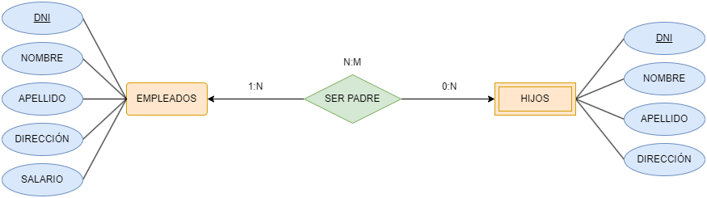
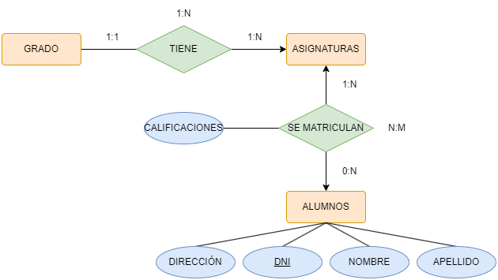
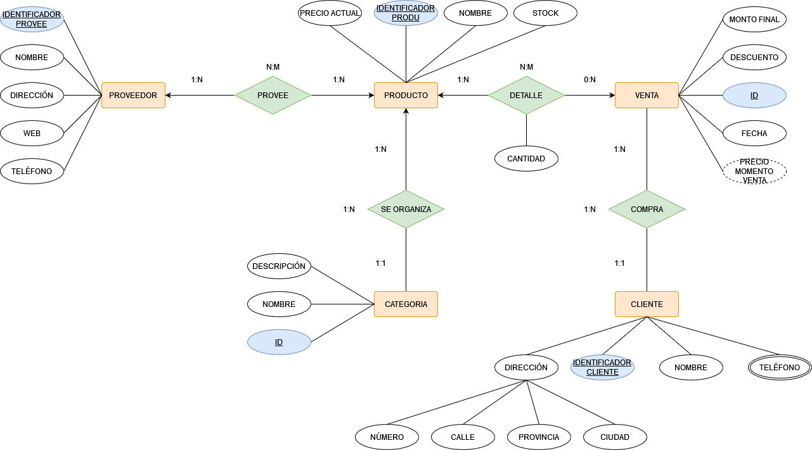
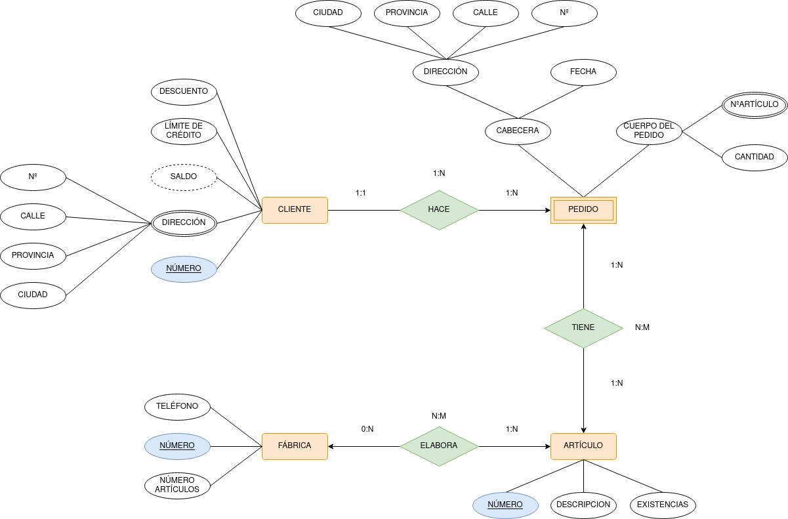

 # EJERCICIO MODELO ENTIDAD-RELACIÓN

Representa las entidades, relaciones y cardinalidades mínimas y máximas para cada uno de los siguientes supuestos:

- En una academia los profesores dan clase a los alumnos matriculados de modo que todo profesor da clase al menos a un alumno y todo alumno recibe clase de un único profesor.

 
 

 
 

- Los profesores de un centro pueden ser o no tutores de un alumno, en cualquier caso los alumnos solo podrán tener un único tutor.

 
 

 
 

- En un comercio, un cliente compra varios productos, y un producto puede ser comprado por varios clientes.

 
 

 
 

- Representa la relación entre Personas y sus padres.

 
 

 
 

- En una carrera de relevos, representar la relación dar el relevo entre atletas(para calcular las cardinalidades máxima y mínima deberás tener en cuenta si se trata de el primero, el último o el 2º o 3º)

 
 

 
 

- Una empresa está compuesta por varios departamentos de los que se desea almacenar su nº, nombre y localidad. - Los empleados deben estar asignados a un departamento y se guardarán sus datos nºempleado, apellido, salario. Además, cada empleado tiene un jefe.

(Nota: se ha supuesto que un departamento puede no tener empleados)

 
 

 
 

- Se desea construir una bd para mantener información sobre los equipos y partidos de la liga. - Un equipo tiene un cierto nº de jugadores (Id_jugador, datos personales) y no todos participan en cada partido. Queremos registrar además por cada partido, qué jugadores juegan, la fecha y la hora del partido, resultados de los encuentros y las posiciones donde juegan.

 
 

 
 

- En una empresa, para cada uno de sus empleados, se guardan los datos de sus hijos. Representa esta relación haciendo las suposiciones que creas convenientes.

 
 

 
 

- Se desea diseñar una BD para una Universidad que contenga información sobre carreras y asignaturas que se pueden estudiar. Además se incluirá la información de los alumnos matriculados en las correspondientes asignaturas y las calificaciones que obtienen en las asignaturas en las que están matriculados. Nota: suponer que una asignatura solo puede pertenecer a una carrera.

 
 

 
 

- Se desea realizar una BD que permita apoyar la gestión de un sistema de ventas. La empresa necesita llevar un control de proveedores, clientes, productos y ventas.

    Un proveedor tiene un identificador, nombre, dirección, teléfono y página web.
    Un cliente también tiene identificador, nombre, dirección, pero puede tener varios teléfonos de contacto. La dirección se entiende por calle, número, provincia y ciudad.
    Un producto tiene un identificador único, nombre, precio actual, stock y nombre del proveedor. Además se organizan en categorías, y cada producto va sólo en una categoría. Una categoría tiene id, nombre y descripción.
    Por razones de contabilidad, se debe registrar la información de cada venta con un id, fecha, cliente, descuento y monto final.
    Además se debe guardar el precio al momento de la venta, la cantidad vendida y el monto total por el producto.

 
 

 

- Se desea crear una base de datos para una pequeña empresa debe contener información acerca de clientes, artículos y pedidos. Hasta el momento se registran los siguientes datos en documentos varios:

    Para cada cliente: Número de cliente (único), Direcciones de envío (varias por cliente), Saldo, Límite de crédito (depende del cliente, pero en ningún caso debe superar los 3.000.000 €), Descuento.

    Para cada artículo: Número de artículo (único), Fábricas que lo distribuyen, Existencias de ese artículo en cada fábrica, Descripción del artículo.

    Para cada pedido: Cada pedido tiene una cabecera y el cuerpo del pedido. La cabecera está formada por el número de cliente, dirección de envío y fecha del pedido. El cuerpo del pedido son varias líneas, en cada línea se especifican el número del artículo pedido y la cantidad.

    Además, se ha determinado que se debe almacenar la información de las fábricas. Sin embargo, dado el uso de distribuidores, se usará: Número de la fábrica (único) y Teléfono de contacto. Y se desean ver cuántos artículos (en total) provee la fábrica. También, por información estratégica, se podría incluir información de fábricas alternativas respecto de las que ya fabrican artículos para esta empresa.

Nota: Una dirección se entenderá como Nº, Calle, Ciudad y Provincia . Una fecha incluye hora.

Se pide hacer el diagrama ER para la base de datos que represente esta información.

 
 

 
 

