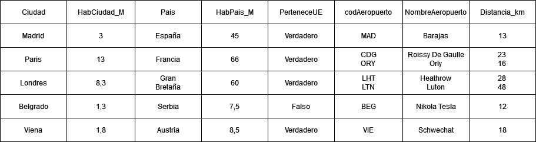
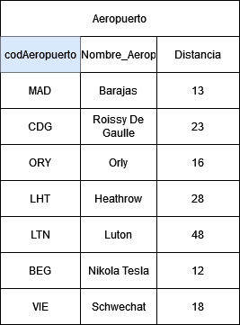
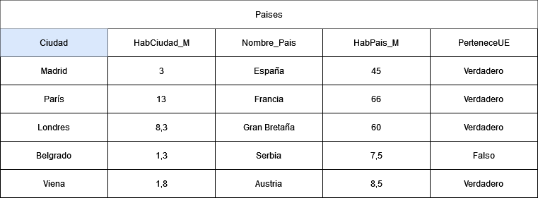
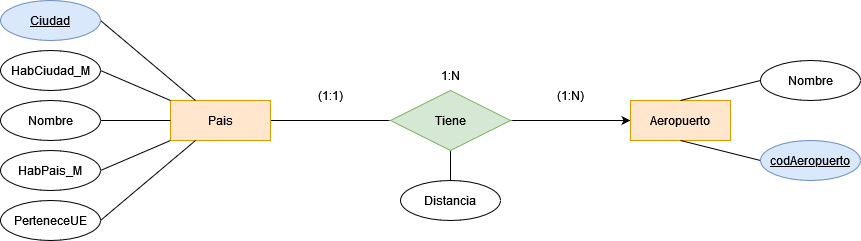
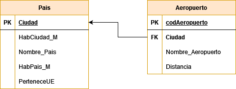
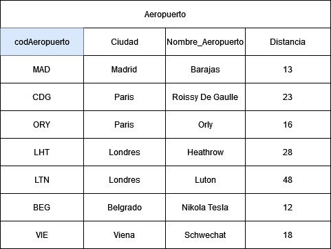

# Gestión de Aeropuertos

## Claves candidatas

Las claves candidatas podrían ser Ciudad, codigoAeropuerto, NombreAeropuerto y Pais, ya que ninguna de las dos tiene valores repetidos.

## Cumplimiento de la 1ª forma normal

No se cumple la primera forma normal ya que en los atributos NombreAeropuerto y Distancia_km existen campos multievaluados.

## Normalización 1ª forma normal

Se normaliza a la primera forma normal creando dos tablas: Aeropuerto y Pais (Se cambia el nombre a los atributos pais y aeropuerto por Nombre_Pais y Nombre_Aeropuerto, para que así el nombre de la tabla no sea redundante)

  

  
  

  
  

  

## Modelo ER a partir de la 1ª Forma Normal

Una vez realizada la 1ª Forma Normal se volverá a hacer el modelo entidad relación que en primera instancia sería erróneo.

  

  

## Modelo Relacional

El modelo relacional fruto de este último modelo ER sería: 

  

  

## Nueva 1ª Forma Normal para la tabla Aeropuerto

Una vez visto el modelo relacional se introduce el campo ciudad dentro de la tabla aeropuerto, ya que esta es una relación 1:N.

## Clabes candidatas

- Tabla Aeropuerto: codAeropuerto y Nombre_Aeropuerto
- Tabla Paises: Ciudad y País