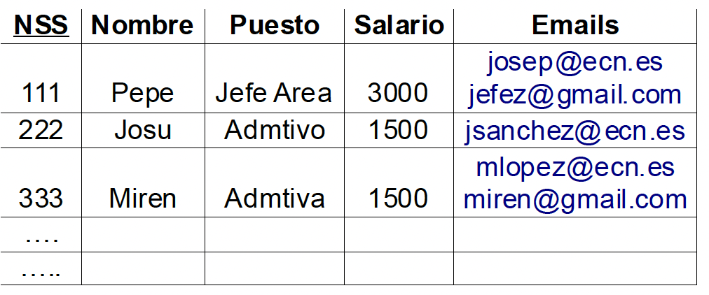
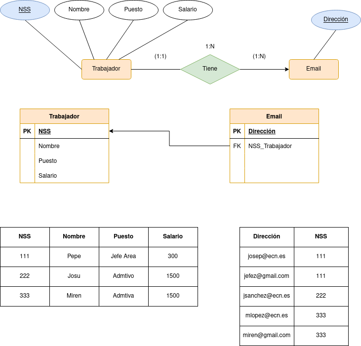
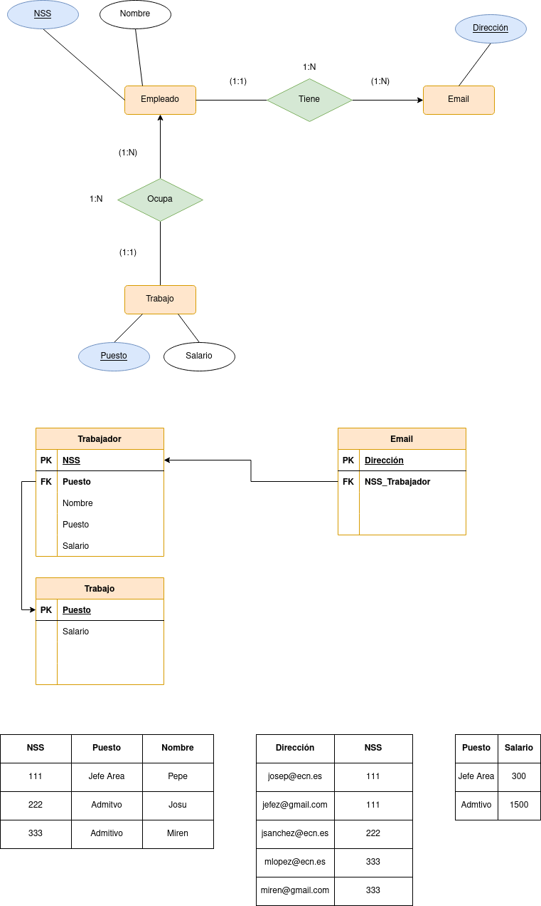
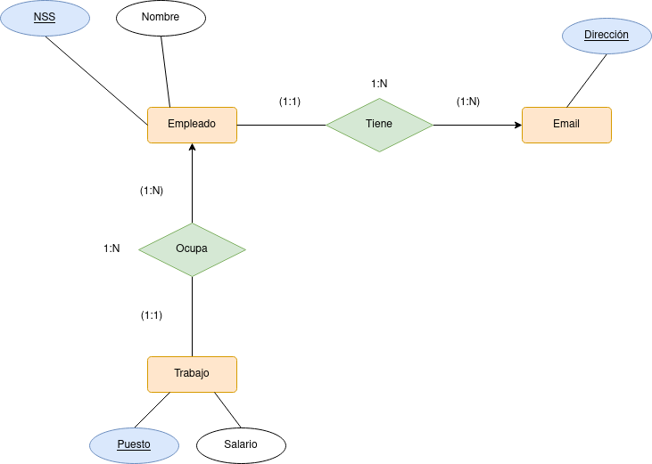

# Gestión de INEM

Tenemos una empresa publica donde los puestos de trabajo, están regulados por el estado, de modo que las condiciones salariales están determinadas por el puesto de trabajo, se ha creado el siguiente esquema relacional: (con el _número de la seguridad social NSS como clave primaria) La representación de la información dentro de la BBDD es la siguiente:

Empleados (NSS, Nombre, puesto, salario, emails)

  

  

    
Claves candidatas

Las claves candidtas en la tabla serán NSS y Emails, ya que son los únicos valores que no se podrán repetir.

    
1ª Forma Normal 

No se cumple la primera forma normal ya que existen valores multievaluados en el atributo Emails, por lo que se aplicará la primera formar normal generando una nueva tabla para emails.

  

  

    
2ª Forma Normal 

La segunda forma normal no se cumple ya que en la tabla trabajador los atributos salario y puesto no tienen relación con la clave primaria que es NSS (Número de la Seguridad Social), por lo que se generará una tabla nueva demominado trabajo con estos dos atributos, con el puesto como clave primaria, ya que los valores  Administrativo  y Administrativa se puede simplificar en uno solo (tienen el mismo salario).

  

  

    
3ª Forma Normal

En este caso la tercera forma normal ya se cumple, ya que no existe transitividad entre los atributos de cada tabla

    
Claves candidates finales

Las claves candidatas por último serán NSS, dirección (de correo electrónico) y puesto de trabajo.

    
Modelo E/R final

  

  

