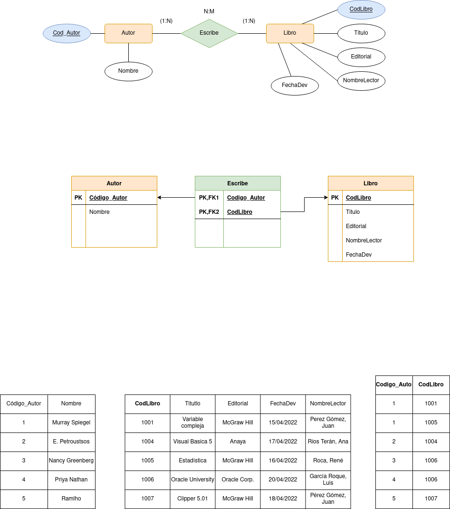
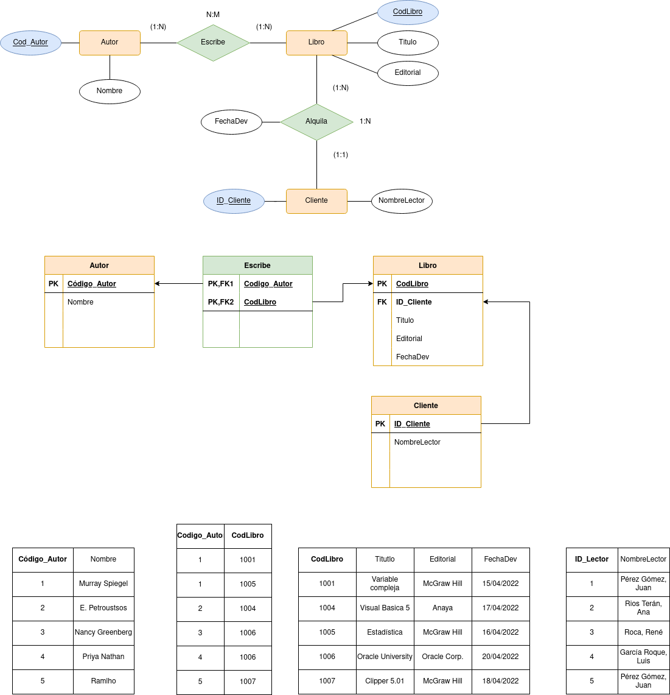
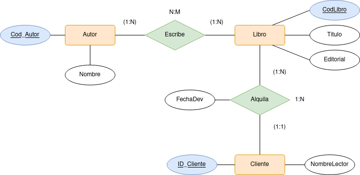

# Biblioteca

Tenemos una biblioteca que tiene como objetivo la gestión de la información de sus libros y lectores.

La representación de la información dentro de la BBDD es la siguiente:

  

| CodLibro | Titulo            | Autor                          | Editorial    | NombreLector       | FechaDev   |
| -------- | ----------------- | ------------------------------ | ------------ | ------------------ | ---------- |
| 1001     | Variable compleja | Murray Spiegel                 | McGraw Hill  | Pérez Gómez, Juan  | 15/04/2022 |
| 1004     | Visual Basic 5    | E. Petroustsos                 | Anaya        | Ríos Terán, Ana    | 17/04/2022 |
| 1005     | Estadística       | Murray Spiegel                 | McGraw Hill  | Roca, René         | 16/04/2022 |
| 1006     | Oracle University | Nancy Greenberg y Priya Nathan | Oracle Corp. | García Roque, Luis | 20/04/2022 |
| 1007     | Clipper 5.01      | Ramalho                        | McGraw Hill  | Pérez Gómez, Juan  | 18/04/2022 |

  

    
Claves candidatas

Las claves candidatas será CodLibro ya que va a aser el único que no se podrá repetir

    
1ª Forma Normal 

No se cumple la primera forma normal ya que existen valores multievaluados en el atributo Autor por lo que se aplicará la primera formar normal generando una nueva tabla para Autor.
Debido a las cardinalidades además se generará una tabla perteneciente a la relación "Escribe"

  

  

    
2ª Forma Normal 

La segunda forma normal en este caso no se cumple debido a que dentro de la tabla de libros encontramos atributos como Nombre de Lector, que no tienen relación con la clave primaria de la misma. Por ello se genera otra tabla Cliente donde se guardará su nombre junto con una clave primaria autogenerada (ID_Cliente)

  

  

    
3ª Forma Normal

En este caso la tercera forma normal ya se cumple, ya que no existe transitividad entre los atributos de cada tabla.

    
Claves candidates finales

Las claves candidatas por último serán Código_Autor, Código_Libro e ID_Cliente

    
Modelo E/R final

  

  

