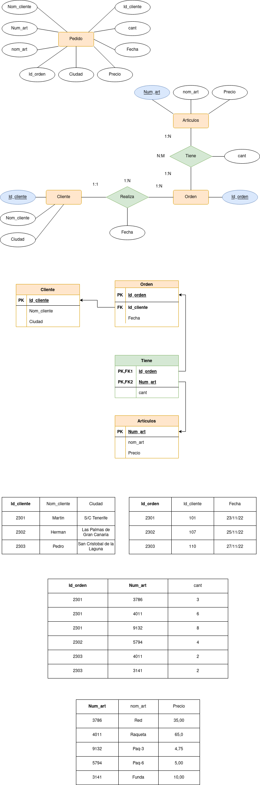

# Pedidos

Tenemos una empresa de pedidos que tiene como objetivo la gestión de la información de sus compras.

La representación de la información dentro de la BBDD es la siguiente:

orden (id_orden, fecha, id_cliente, nom_cliente, ciudad, num_art, nom_art, cant, precio)

 

| Id_orden |  Fecha |  Id_cliente |  Nom_cliente |  Ciudad |  Num_art |  nom_art |  cant |  Precio |
|-----|-----|-----|-----|-----|-----|-----|-----|-----| 
| 2301 |  23/11/22 |  101 |  Martin |  S/C Tenerife |  3786 |  Red |  3 |  35,00 |
| 2301 |  23/11/22 |  101 |  Martin |  S/C Tenerife |  4011 |  Raqueta |  6 |  65,00 |
| 2301 |  23/11/22 |  101 |  Martin |  S/C Tenerife |  9132 |  Paq-3 |  8 |  4,75 |
| 2302 |  25/11/22 |  107 |  Herman |  Las Palmas de Gran Canaria |  5794 |  Paq-6 |  4 |  5,00 |
| 2303 |  27/11/22 |  110 |  Pedro |  San Cristobal de la Laguna |  4011 |  Raqueta |  2 |  65,00 |
| 2303 |  27/11/22 |  110 |  Pedro |  San Cristobal de la Laguna |  3141 |  Funda |  2 |  10,00 |

    
1ª Forma Normal 

No se cumple la primera forma normal ya que existen valores multievaluados en el atributo Autor por lo que se aplicará la primera formar normal generando una nueva tabla para Autor.
Debido a las cardinalidades además se generará una tabla perteneciente a la relación "Escribe"

  

    
2ª Forma Normal 

Una vez corregida la tabla para la primera forma normal, se cumple la segunda y la tercera, ya que las tablas están agrupadas correctamente y no existe transitividad en ninguna de ellas.
 
Así pues, para finalizar, las claves candidatas de cada tabla serán Id_cliente, Id_orden y Num_art

  

