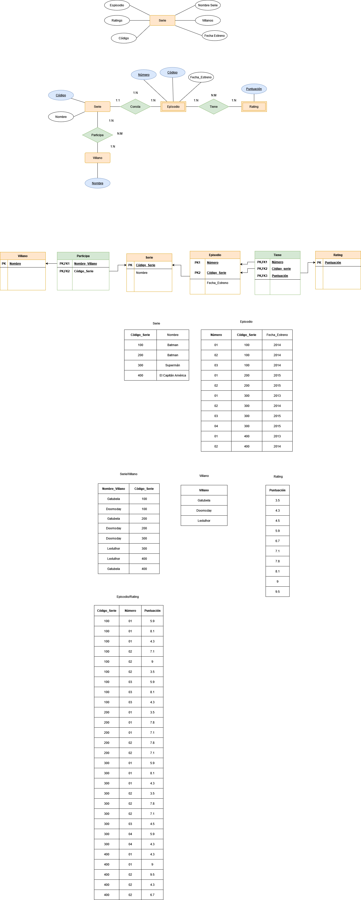

# Villanos

Tenemos una empresa dedicada al mundo de las series que tiene como objetivo la gestión de la información de estas.

La representación de la información dentro de la BBDD es la siguiente:

 

|Código | Episodio | Nombre Serie | Villanos | Fecha Estreno | Ratings | 
|-----|-----|-----|-----|-----|-----|
|100 | 01 | Batman | Gatubela,Doomsday |  2014 | 5.9,8.1,4.3 |
|100 | 02 | Batman | Gatubela,Doomsday |  2014 | 7.1,9,3.5 |
|100 | 03 | Batman | Gatubela,Doomsday |  2014 | 5.9,8.1,4.3 | 
|200 | 01 | Batman | Gatubela,Doomsday |  2015 | 3.5,7.8,7.1 | 
|200 | 02 | Batman | Gatubela,Doomsday |  2015 | 7.8,7.1 | 
|300 | 01 | Superman | Doomsday,LexLuthor |  2013 | 5.9,8.1,4.3 | 
|300 | 02 | Superman | Doomsday,LexLuthor |  2014 | 3.5,7.8,7.1 | 
|300 | 03 | Superman | Doomsday,LexLuthor |  2015 | 4.5 | 
|300 | 04 | Superman | Doomsday,LexLuthor |  2015 | 5.9,4.3 | 
|400 | 01 | El Capitán América | LexLuthor,Gatubela |  2013 | 4.3,9 | 
|400 | 02 | El Capitán América | LexLuthor,Gatubela |  2014 | 9.5,4.3,6.7 | 

    
1ª Forma Normal 

No se cumple la primera forma normal ya que existen valores multievaluados en los atributos Ratings y Villanos, así como tampoco las claves primarias son únicas por lo que se aplicará la primera formar normal generando nuevas tablas para serie, episodio, villanos y ratings.
Además, debido a las cardinalidades se generarán las tablas "Participa" y "Tiene".
  

    
2ª Forma Normal 

Una vez corregida la tabla para la primera forma normal, se cumple la segunda y la tercera, ya que las tablas están agrupadas correctamente y no existe transitividad en ninguna de ellas.
 
Así pues, para finalizar, las claves candidatas de cada tabla serán Código_Serie, Código_Episodio, Nombre_Villano y Puntuación.

  

