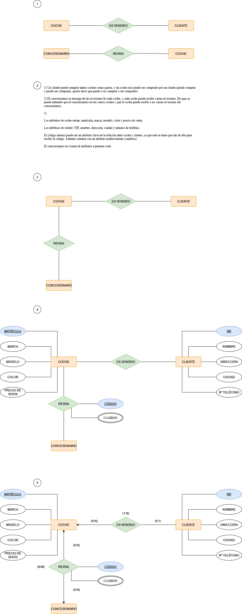
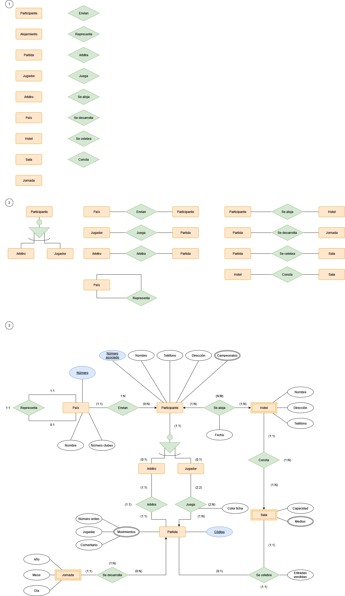

# Tarea 4 (2-9)

 # EJERCICIOS MODELO ENTIDAD-RELACIÓN

## 6)

“Se desea diseñar una base de datos para almacenar y gestionar la información empleada por una empresa dedicada a la venta de automóviles, teniendo en cuenta los siguientes aspectos: La empresa dispone de una serie de coches para su venta. Se necesita conocer la matrícula, marca y modelo, el color y el precio de venta de cada coche. Los datos que interesa conocer de cada cliente son el NIF, nombre, dirección, ciudad y número de teléfono: además, los clientes se diferencian por un código interno de la empresa que se incrementa automáticamente cuando un cliente se da de alta en ella. Un cliente puede comprar tantos coches como desee a la empresa. Un coche determinado solo puede ser comprado por un único cliente. El concesionario también se encarga de llevar a cabo las revisiones que se realizan a cada coche. Cada revisión tiene asociado un código que se incrementa automáticamente por cada revisión que se haga. De cada revisión se desea saber si se ha hecho cambio de filtro, si se ha hecho cambio de aceite, si se ha hecho cambio de frenos u otros. Los coches pueden pasar varias revisiones en el concesionario”.

 
 

 
 

El club de Ajedrez IES Puerto, ha sido encargado por la Federación Internacional de Ajedrez de la organización de los próximos campeonatos mundiales que se celebrarán en la mencionada localidad. Por este motivo, desea llevar a una base de datos toda la gestión relativa a participantes, alojamientos y partidas. Teniendo en cuenta qué:
- En el campeonato participan únicamente jugadores y árbitros; de ambos se requiere conocer el número de asociado, nombre, dirección, teléfono de contacto y campeonatos en los que han participado. De los jugadores se precisa además el nivel de juego en una escala de 1 a 10.
- Ningún árbitro puede participar como jugador.
- Los países envían al campeonato un conjunto de jugadores y árbitros, aunque   no todos los países envían participantes. Todo jugador y árbitro es enviado por un único país. Un país puede ser representado por otro país.
- Cada país se identifica por un número e interesa además conocer su nombre y el número de clubes de ajedrez existentes en el mismo.
- Cada partida se identifica por un código ( Cod_P ), jugada por dos jugadores y arbitrada por un árbitro. Interesa registrar las partidas que juega cada jugador y el color ( blancas o negras ) con el que juega. Ha de tenerse en cuenta que un árbitro no puede arbitrar a jugadores enviados por el mismo país que le ha enviado a él.
- Todo participante participa en al menos una partida.
- Tanto jugadores como árbitros se alojan en uno de los hoteles en los que se desarrollan las partidas, se desea conocer en qué hotel y en qué fechas se ha alojado cada uno de los participantes. Los participantes pueden no permanecer en el Puerto durante todo el campeonato, sino acudir cuando tienen que jugar alguna partida alojándose en el mismo o distinto hotel. De cada hotel, se desea conocer el nombre, la dirección y el número de teléfono.
- El campeonato se desarrolla a lo largo de una serie de jornadas (año, mes, día) y cada partida tiene lugar en una de las jornadas aunque no tengan lugar partidas todas las jornadas.
- Cada partida se celebra en una de las salas de las que pueden disponer los hoteles, se desea conocer el número de entradas vendidas en la sala para cada partida. De cada sala, se desea conocer la capacidad y medios de que dispone (radio, televisión, vídeo...) para facilitar la retransmisión de los encuentros. Una sala puede disponer de varios medios distintos.
- De cada partida se pretende registrar todos los movimientos que la componen, la identificación de movimiento se establece en base a un número de orden dentro de cada partida: para cada movimiento se guardan la jugaday un breve comentario realizado por un experto.

 
 

 
 
