# Ejercicios 1-11

## 1. Ejercicios básicos E/R

Representa las entidades, relaciones y cardinalidades mínimas y máximas para cada uno de los siguientes supuestos:

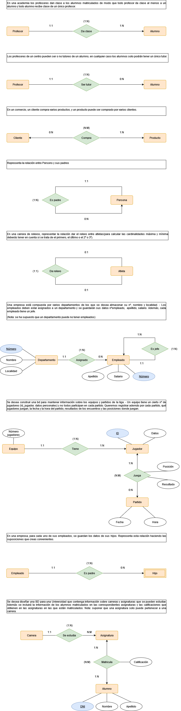

## 2.Sistema de ventas

Se desea realizar una BD que permita apoyar la gestión de un sistema de ventas. La empresa necesita llevar un control de proveedores, clientes, productos y ventas.

- Un proveedor tiene un identificador, nombre, dirección, teléfono y página web.
- Un cliente también tiene identificador, nombre, dirección, pero puede tener varios teléfonos de contacto. La dirección se entiende por calle, número, provincia y ciudad.
- Un producto tiene un identificador único, nombre, precio actual, stock y nombre del proveedor. Además se organizan en categorías, y cada producto va sólo en una categoría. Una categoría tiene id, nombre y descripción.
- Por razones de contabilidad, se debe registrar la información de cada venta con un id, fecha, cliente, descuento y monto final.
- Además se debe guardar el precio al momento de la venta, la cantidad vendida y el monto total por el producto.

 

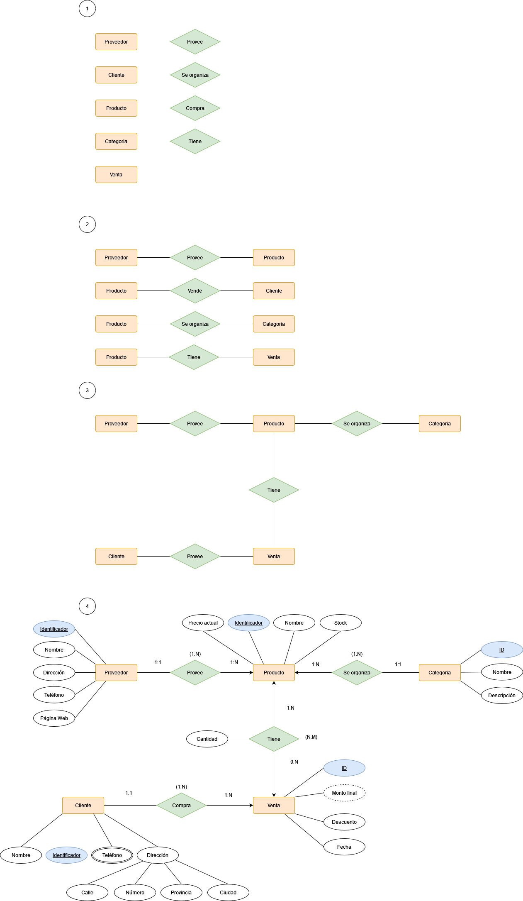

 

### Atributos:

Los atributos a comentar son: 

- "Cantidad" en la relación "Tiene" entre "Producto" y "Venta": Este atributo se ubica dentro de la relación ya que la cantidad de producto dentro de una venta tendrá sentido cuando se efectue la misma.
- "Monto final" en la entidad "Venta": Es un atributo derivado, ya que su cálculo dependerá del descuento que se le aplique al precio del producto.
- "Teléfono" en la entidad "Cliente". Es un atirbuto multievaluado ya que en el propio texto se menciona que un cliente puede tener varios teléfonos.
- "Dirección" en la entidad "Cliente": Se trata de un atributo compuesto, ya que como bien se dice en el problema "La dirección se entiende por calle, número, provincia y ciudad".

### Cardinalidades: 

- Proveedor-Provee-Producto: Un proveedor podrá proveer como mínimo un producto y como máximo muchos, mientras que un producto solo va a ser proveido por un único proveedor. Cardinalidad 1:N
- Producto-Se organiza-Categoria: Un producto se va a organizar como mínino y como máximo en una categoría, ya que no puede haber productos sin categoria o en dos categorias a la vez, mientras que en una categoría habra como mínimo un producto o muchos. Cardinalidad 1:N
- Porducto-Tiene-Venta: Un producto podrá tener una ventas o no, mientras que una venta tendrá como mínimo un producto o muchos. Cardinalidad N:M
- Cliente-Compra-Venta: Un cliente podrá comprar entre una y muchas ventas, mientras que una venta solo podrá ser comprada como mínimo y máximo por un cliente.

## 3. Sistema de Artículos - Encargos

Se desea crear una base de datos para una pequeña empresa debe contener información acerca de clientes, artículos y
pedidos.
Hasta el momento se registran los siguientes datos en documentos varios:
 - Para cada cliente: Número de cliente (único), Direcciones de envío (varias por cliente), Saldo, Límite de crédito (depende del cliente, pero en ningún caso debe superar los 3.000.000 €), Descuento.
 - Para cada artículo: Número de artículo (único), Fábricas que lo distribuyen, Existencias de ese artículo en cada fábrica, Descripción del artículo.
- Para cada pedido: Cada pedido tiene una cabecera y el cuerpo del pedido. La cabecera está formada por el número de cliente, dirección de envío y fecha del pedido. El cuerpo del pedido son varias líneas, en
cada línea se especifican el número del artículo pedido y la cantidad.

- Además, se ha determinado que se debe almacenar la información de las fábricas. Sin embargo, dado el
uso de distribuidores, se usará: Número de la fábrica (único) y Teléfono de contacto. Y se desean ver cuántos artículos (en total) provee la fábrica. También, por información estratégica, se podría incluir información de fábricas alternativas respecto de las que ya fabrican artículos para esta empresa.

__Nota__: Una dirección se entenderá como Nº, Calle, Ciudad y Provincia . Una fecha incluye hora.

 

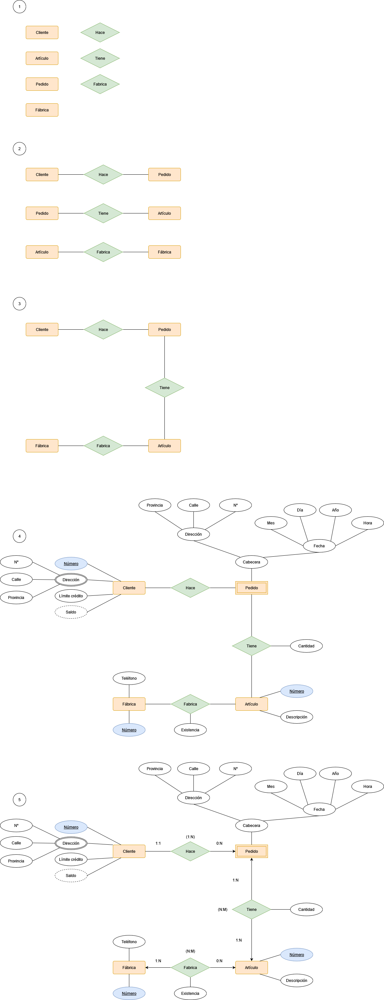

 

### Entidades:

En este diagrama, la entidad "Pedido" es debil debido a que su existencia no tendría sentido si no hubiera un cliente que realizara el pedido.

### Atributos:

Los atributos a destacar son: 

- "Dirección" de la entidad "Cliente": Este atributo es multievaluada, ya que se especifica que un cliente puede tener diversas direcciones, y compuesta, ya que la dirección se compone (según el problema) del número, calle y provincia.
- "Saldo" de la entidad "Cliente: Se trata de un atributo se caracteriza por ser derivado de "Límite de crédito", es decir, se puede calcular a través de este.
- "Existencia" en la relación "Fabrica": Este atributo se situa en esta relación ya que la existencia de un artículo solo tendrá sentido en la relación entre la fábrica y el artículo, ya que es en este punto donde se determina la existencia o no del mismo.
- "Cabecera" en la entidad "Pedido": Aunque el texto mencione una serie de atributos para la entidad "Pedido", solo serán representadas aquellas que no se repitan en las entidades relacionadas con la misma, ya que si no se estaria cayendo en un caso de redundancia. Así pues, debido a esto solo es necesario colocar aquel atributo no repetido, que es, en este caso, "Cabecera". No obstante el atributo dirección estaría exento de lo dicho anteriormente debido a que en la entidad "Pedido" se habla de una sola dirección, es decir, se especifica, a diferencia de la "Dirección" de "Cliente", la cual puede tener varias.

### Cardinalidades:

- Cliente-Hace-Pedido: Un cliente puede realizar o no pedidos, mientras que un pedido debe ser realiza como máximo y como mínimo por un cliente. Cardinalidad 1:N
- Pedido-Tiene-Artículo: Un pedido puede tener entre uno y varias artículos, y un artículo puede encontrarse en uno o en varios pedidos. Cardinalidad N:M
- Fábrica-Fabrica-Artículo: Una fábrica puede o no fabricar artículos (en el texto se especifica que se tiene en cuenta aquellas fábricas que aún no producen el artículo) y un artículo puede ser fabricado en una o en diversas fábricas (un mismo artículo se puede fabricar en fábricas diferentes). Cardinalidad N:M

## 4. Sistema de Reparto

A partir del siguiente enunciado se desea realizar el modelo __entidad-relación__. Se desea informatizar la gestión de una empresa de reparto de mercancías que reparte paquetes por toda la isla. Los encargados de llevar los paquetes son los camioneros, de los que se quiere guardar el dni, nombre, teléfono, dirección, salario y población en la que vive. De los paquetes transportados interesa conocer el código de paquete, descripción, destinatario y dirección del destinatario. Un camionero distribuye muchos paquetes, y un paquete sólo puede ser distribuido por un camionero. De los camiones que llevan los camioneros, interesa conocer la matrícula, modelo, tipo y potencia. Un camionero puede conducir diferentes camiones en fechas diferentes, y un camión puede ser conducido por varios camioneros.
 

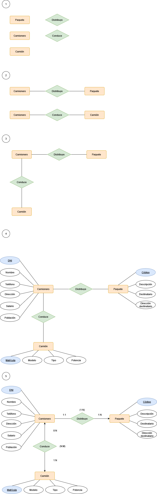

 

### Cardinalidades:

- Camionero-Distribuye-Paquete: Un camionero va a distribuir entre uno y varios paquetes, mientras que un paquete será distirbuido por un único camionero. Cardinalidad 1:N
- Camionero-Conduce-Camión: Un camnionero conduce uno o diversos camiones, mientras que un camión puede ser o no conducido por camioneros. Cardinalidad N:M

## 5. Profesorado

“Se desea diseñar la base de datos de un Instituto. En la base de datos se desea guardar los datos de __los profesores del Instituto__ (_DNI, nombre, dirección y teléfono_). Los profesores imparten __módulos__, y cada módulo tiene un _código y un nombre_. Cada __alumno__ _está matriculado en uno o varios módulos_. De cada alumno se desea guardar el _nº de expediente, nombre, apellidos y fecha de nacimiento_. _Los profesores pueden impartir varios módulos, pero un módulo sólo puede ser impartido por un profesor_. Cada _curso tiene un grupo de alumnos, uno de los cuales es el delegado del grupo_”.

 

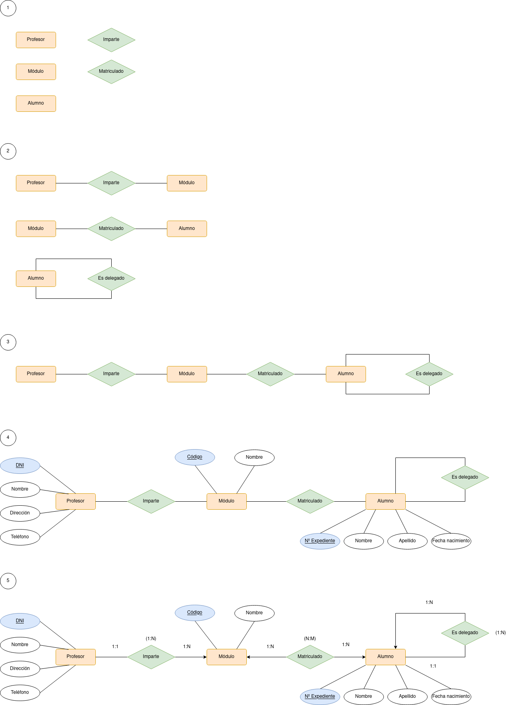

 

### Entidades

- La entidad alumno está relacionado con si misma a través de una relación denominada "Es delegado", por lo que esta es una reflexiva. Esto es así ya que en el texto se menciona que "Cada _curso tiene un grupo de alumnos, uno de los cuales es el delegado del grupo_”. 

### Cardinalidades

- Profesor-Imparte-Módulo: Un profesor puede impartir desde uno a varios módulos, mientras que un módulo solo podrá ser impartido por un único profesor. Cardinalidad 1:N
- Módulo-Matriculado-Alumno: En un módulo se matriculan muchos alumnos al igual que un alumno se matricula en muchos modulos. Cardinalidad N:M
- Alumno-Es delegado-Alumno: Un alumno será delegado de entre uno y varios alumnos, mientras que un alumno solo tendrá un único delegado. Cardinalidad 1:N

## 6. Sistema Gestión de ventas de Automóviles

“Se desea diseñar una base de datos para almacenar y gestionar la información empleada por una empresa dedicada a la venta de automóviles, teniendo en cuenta los siguientes aspectos: La empresa dispone de una serie de coches para su venta. Se necesita conocer la matrícula, marca y modelo, el color y el precio de venta de cada coche. Los datos que interesa conocer de cada cliente son el NIF, nombre, dirección, ciudad y número de teléfono: además, los clientes se diferencian por un código interno de la empresa que se incrementa automáticamente cuando un cliente se da de alta en ella. Un cliente puede comprar tantos coches como desee a la empresa. Un coche determinado solo puede ser comprado por un único cliente. El concesionario también se encarga de llevar a cabo las revisiones que se realizan a cada coche. Cada revisión tiene asociado un código que se incrementa automáticamente por cada revisión que se haga. De cada revisión se desea saber si se ha hecho cambio de filtro, si se ha hecho cambio de aceite, si se ha hecho cambio de frenos u otros. Los coches pueden pasar varias revisiones en el concesionario”.

 

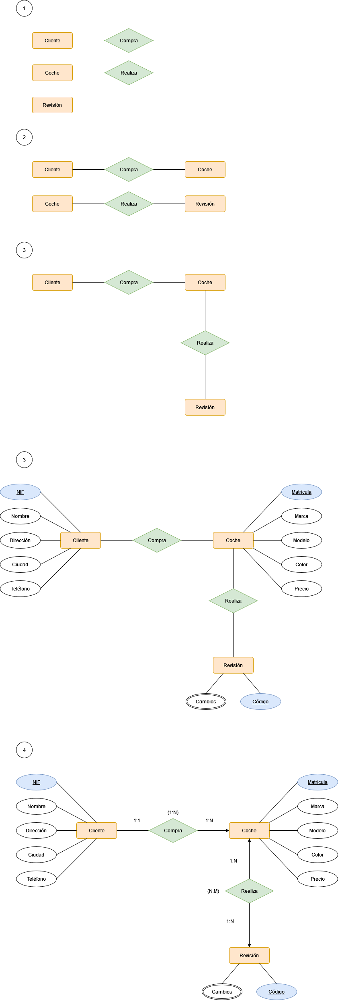

 

### Atributos

El atributo a destacar seria "Cambios". Este es multievaluado ya que en el texto se especifica que a un coche se le pueden hacer diversos cambios en una revisión.

### Cardinalidades

- Cliente-Compra-Coche: Un cliente puede comprar entre uno y cuantos coches quiera, mientras que un coche solo puede ser comprado por un único cliente. Cardinalidad 1:N
- Coche-Realiza-Revisión: A un mismo coche se le puede realizar entre una y varias revisiones al igual que una revisión puede ser hecha a uno o varios coches. Cardinalidad N:M

## 7. Sistema Empresa Tecnológica

Para presentar los siguientes conceptos vamos a partir de un ejemplo de entidad que se encuentra en la mayoría de _empresas_: la entidad __EMPLEADO__. En la mayoría de empresas existen distintos tipos de empleados, cuya descripción es difícil de recoger utilizando una misma entidad.

Por ejemplo en un centro de enseñanza nos podemos encontrar con _profesores, personal de administración, personal de limpieza y mantenimiento_, etc. De los profesores, por ejemplo, tendremos que recoger información que no se requiere para el resto de personal. Por ejemplo: el número de registro personal, la especialidad, el cuerpo al que pertenece, la fecha de alta en el cuerpo, etc.

 

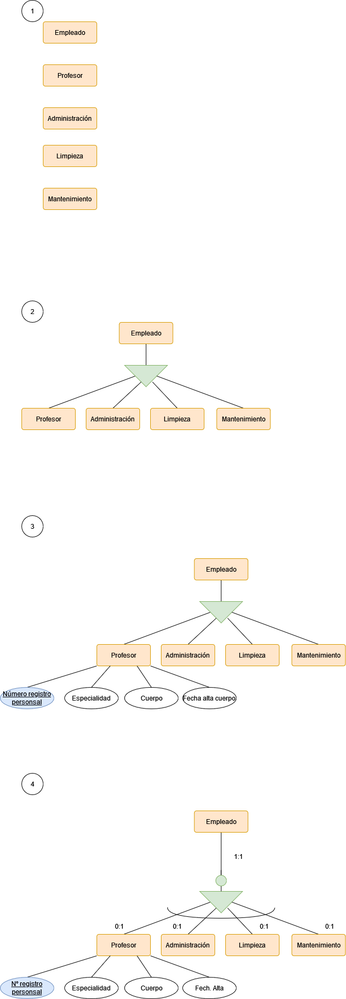

 

### Entidades

En este caso la importancia radica en la entidad "Empleado" que tendrá como entidades hija a "Profesor, Administración, Limpieza y Mantenimiento". Esto es así debido a que "Profesor" tiene una serie de atributos que lo diferencian de el resto, por lo que estas entidades no podrán ser simplemente dominios de un atributo dentro de la entidad superior.

### Cardinalidades

La cardinalidad dependerá en gran medida del tipo de relación jerárquica que sea, en este caso se trata de una relación exclusiva y total, ya que ningún empleado puede tener dos profesiones a la vez así como deberán estar definidas dentro de la relación (el empleado no puede realizar un trabajo que no sea el especificado). Dicho esto la relación que habrá sera 0:1 del empleado a la profesión, ya que el empleado podrá ser o no una de ellas, pero siempre una profesión será de un empleado 1:1.

## 8. Sistema Instituto Secundaria

Queremos recoger la información correspondiente a las aulas de un instituto de secundaria con la especialidad de informática:

- De cada aula se quiere recoger la siguiente información: NºAula, Piso, Pasillo, Nº plazas. El número de aula es único y distinto para todas ellas.
- Cuando las aulas son salas de ordenadores necesitamos saber: nº de ordenadores, escáner y nº de impresoras, así como otros equipamientos que pudieran instalarse.
- Si se trata de laboratorios queremos saber el tipo (de ciencias, de idioma, etc.) y el equipamiento que tiene.
- Todas las aulas, sean comunes, laboratorios o salas de ordenadores, pueden tener o no proyector y pizarra interactiva.
- Existen otros tipos de aulas no recogidos en el modelo anterior como gimnasio, biblioteca, etc.
- Cada aula se utiliza únicamente para las funciones que tiene asignadas (no se imparte una clase normal en un laboratorio, etc.)

 

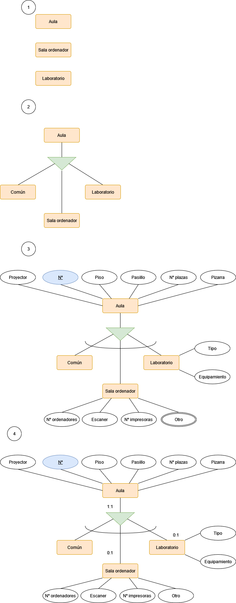

 

### Entidades

Destaca una relación de jerarquía exclusiva parcial entre la entidad "Aula" y "Común, Sala ordenador y Laboratorio". Es parcial ya que en el propio texto se menciona que existen otro tipo de aulas fuera de las mencionadas. Por otro lado, es una jerarquía ya que "Sala ordenador" y "Laboratorio" tienen entidades propias, por lo que no podria tratarse de valores de dominio de un atributo de la entidad "Aula".

### Cardinalidades

La cardinalidad en la jerarquía será para las diferentes sales al aula 1:1 ya que toda clase deverá ser un aula, mientras que un aula puede ser o no una clase en específico, es decir 0:1

## 9. Campeonato del mundo de Ajedrez

El club de Ajedrez IES Puerto, ha sido encargado por la Federación Internacional de Ajedrez de la organización de los próximos campeonatos mundiales que se celebrarán en la mencionada localidad. Por este motivo, desea llevar a una base de datos toda la gestión relativa a participantes, alojamientos y partidas. Teniendo en cuenta qué:
- En el campeonato participan únicamente jugadores y árbitros; de ambos se requiere conocer el número de asociado, nombre, dirección, teléfono de contacto y campeonatos en los que han participado. De los jugadores se precisa además el nivel de juego en una escala de 1 a 10.
- Ningún árbitro puede participar como jugador.
- Los países envían al campeonato un conjunto de jugadores y árbitros, aunque   no todos los países envían participantes. Todo jugador y árbitro es enviado por un único país. Un país puede ser representado por otro país.
- Cada país se identifica por un número e interesa además conocer su nombre y el número de clubes de ajedrez existentes en el mismo.
- Cada partida se identifica por un código ( Cod_P ), jugada por dos jugadores y arbitrada por un árbitro. Interesa registrar las partidas que juega cada jugador y el color ( blancas o negras ) con el que juega. Ha de tenerse en cuenta que un árbitro no puede arbitrar a jugadores enviados por el mismo país que le ha enviado a él.
- Todo participante participa en al menos una partida.
- Tanto jugadores como árbitros se alojan en uno de los hoteles en los que se desarrollan las partidas, se desea conocer en qué hotel y en qué fechas se ha alojado cada uno de los participantes. Los participantes pueden no permanecer en el Puerto durante todo el campeonato, sino acudir cuando tienen que jugar alguna partida alojándose en el mismo o distinto hotel. De cada hotel, se desea conocer el nombre, la dirección y el número de teléfono.
- El campeonato se desarrolla a lo largo de una serie de jornadas (año, mes, día) y cada partida tiene lugar en una de las jornadas aunque no tengan lugar partidas todas las jornadas.
- Cada partida se celebra en una de las salas de las que pueden disponer los hoteles, se desea conocer el número de entradas vendidas en la sala para cada partida. De cada sala, se desea conocer la capacidad y medios de que dispone (radio, televisión, vídeo...) para facilitar la retransmisión de los encuentros. Una sala puede disponer de varios medios distintos.
- De cada partida se pretende registrar todos los movimientos que la componen, la identificación de movimiento se establece en base a un número de orden dentro de cada partida: para cada movimiento se guardan la jugaday un breve comentario realizado por un experto.

 

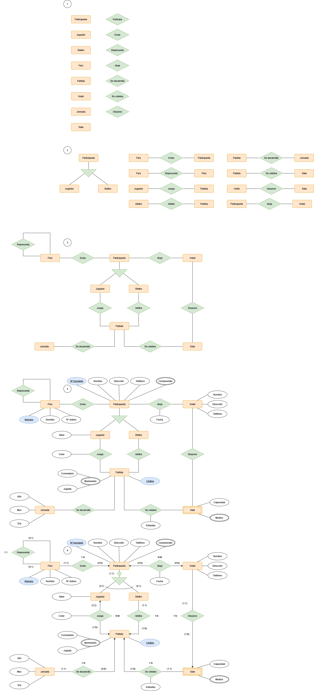

 

### Entidades

Las entidades a destacar son:

- Participante: Tendrá una relación jerárquica exlcusiva total con jugador y árbitro, ya que jugador consta de un atributo específico (nivel) que lo diferenciará de árbitro.
- Sala: Se trata de una entidad debil debido a que su existencia dependerá de la presencia de la entidad "Hotel".

### Atributos

- Campeonato: Se encuentra dentro de la entidad "Participante" y será un atributo multievaulado ya que de un participante se guardará más de un campeonato que haya jugado, es decir, tendrá más de un valor.
- Fecha: Se encuentra en la relación "Aloja" entre las entidades "Participante" y "Hotel". Esto es así ya que la fecha de alojamiento solo tendrá sentido cuando se realice la acción, y no en el participante o en el propio hotel.
- Movimiento: En la entidad "Partida". Es un atributo multievaluado ya que en una partida se pueden realizar diversos movimientos, y compuesta, ya que la misma se compone de otros dos atributos (podria guardarse como una entidad nueva).
- Entrada: En la relación "Se celebra" entre "Partida" y "Sala", ya que las entradas vendidas de una sala en una partida solo tendrán sentido cuando se produzca la relación.
- Medios: En la entidad debil "Sala". Es multievaluada ya que en el texto se especifica que podrán haber varios medios en una misma sala.

### Cardinalidades

- País-Representa-País: Es una relación reflexiva donde un país podrá representar o no a otro país y un país es representado o no por otro país. No tendría sentido que un país pudiera representar a varios países. Cardinalidad 1:1
- País-Envia-Participante: Un país puede enviar o no a participantes mientras que un participante debe de ser enviado por un pais. Cardinalidad 1:N
- Participante-Aloja-Hotel: Un participante se puede alojar o no en hoteles, mientras que en un hotel (donde se va a realizar el campeonato) pueden alojarse o no participantes como especifica el texto ("Los participantes pueden no permanecer en el Puerto durante todo el campeonato, sino acudir cuando tienen que jugar alguna partida alojándose en el mismo o distinto hotel"). Cardinalidad N:M
- Jugador-Juega-Partida: Un jugador tiene que jugar si o si al menos una partida, mientras que una partida debe ser jugada por dos jugadores (en el caso del ajedrez). Cardinlidad N:M
- Árbitro-Arbitra-Partida: Un árbitro tiene que arbitrar si o si como mínimo una partida, mientras que en una partida solo habrá un árbitro. Cardinalidad 1:N
- Partida-Se desarrolla-Jornada: Una partida se deberá de desarrollar en una jornada, mientras que en una jornada se pueden o no celebrar varias partidas. Cardinalidad 1:N
- Partida-Se celebra-Sala: Una partida solo se puede celebrar en una única sala, mientras que en una sala se celebrarán entre una y muchas partidas. Cardinalidad 1:N
- Hotel-Dispone-Sala: Un hotel dispondrá de una o varias salas mientras que una sala deberá de estar en un hotel. Cardinalidad 1:N

## 10. Star-Trek

Un club de fans de la famosa película Star Trek, ha decidido crear una página web donde se pueda consultar información referente a todas las películas y capítulos de la saga. El dominio startrekfans.com se redirigirá a
un servidor web que consulte una base de datos con la siguiente información:
- Actores: es necesario conocer el nombre del actor, el personaje que interpreta, la fecha de nacimiento y su nacionalidad.
- Personajes: es necesario saber el nombre, graduación militar que
desempeña (capitán, teniente, almirante, etc) y su raza (humano,vulcano, klingon). Si el personaje es humano, se indicará su fecha de
nacimiento y ciudad terráquea donde nació, si el personaje es de la raza Vulcano, se almacenará el nombre del mento y la fecha de graduación, y si es de raza Klingon, se guardará su planeta natal y la fecha de su último combate. Es importante conocer el actor que interpreta el personaje, teniendo en cuenta que, un personaje sólo puede ser interpretado por un actor, y un actor sólo puede interpretar un personaje. Además, será necesarios conocer el personaje del que depende directamente en graduación militar.
- Capítulos: hay que almacenas todos los capítulos, indicando a que temporada pertenece cada capítulo, el título, el orden en el que fue rodado, fecha de su primera emisión en televisión y los personajes que participaron en cada capítulo.
- Películas: se debe almacenar también, todas las películas que se proyectaron en cines, cada una con su año de lanzamiento, título y director. También hay que guardar los personajes que aparecen en cada película y cuál de ellos fue el protagonista.
- Planetas: en cada capítulo, se visita uno o varios planetas, hay que almacenar el código del planeta, su nombre, galaxia a la que pertenece, el problema que se resolvió en esa visita y la nave con la que se viajó al planeta. Para la descripción de la nave se almacenará el nombre, código y número de tripulantes. La nave que viaja a un planeta puede disponer de una nave pequeña llamada lanzadera con la que bajan a la superficie del planeta. La existencia de la lanzadera solo tiene sentido si existe la nave a la que pertenece. Se identificará cada lanzadera mediante un número entero y el código de la nave. Es necesario conocer la capacidad en personas de la lanzadera.

 

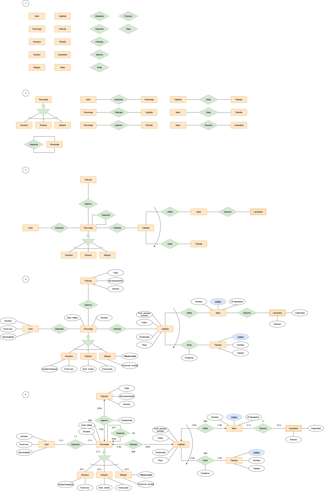

 

### Entidades y relaciones

- Personaje: Existe una relación de jerarquía exlcusiva total entre la entidad "Personaje" y las entidades "Humano, Vulcano y Klingon". Esto se debe a que cada una de estas entidades tienen atributos específicos, por lo que no podrian ser dominios de un atributo de la entidad "Personaje"

- Capítulo: Esta entidad se encuentra relacionada con dos entidades "Nave" y "Planeta". Sin embargo la relación entre "Capítulo" y "Planeta" solo se dará cuando "Capítulo" se relacione con "Nave", lo que quiere decir que un planeta solo podrá ser visitado una vez se utilice una nave. Es decir, existe una restricción de inclusividad entre las dos relaciones respecto a la entidad "Capítulo".

- Lanzadera: Se trata de una entidad debil debido a que sin nave no existirá lanzadera.

- Personaje: Un personaje por rango dependerá de otro personaje, por lo que se genera una relación reflexiva.

### Atributos

- Protagonista: El atributo "Protagonista" se encuentra dentro de la relación "Aparece" entre "Película" y "Entidad". Esto se debe a que un personaje solo será protagonista cunaod aparezca en una película, por lo que no tendria sentido guardar la misma dentro de personaje o dentro de la propia película.
- Problema: Se encuentra en la relación "Visita" entre la entidad "Capítulo" y "Planeta". Esta pertenece a la relación debido a que el problema que se resuelve en el capítulo solo se dará cuando se relacione con un planeta.

### Cardinalidades

- Actor-Interpreta-Personaje: Un actor interpreta solo a un personaje y un personaje es interpretado solo por un actor. Cardinalidad 1:1
- Personaje-Aparece-Película: Un personaje puede aparecer o no en películas (un personaje puede aparecer en un capítulo pero no en una película), y en una película aparece al menos un personaje. Cardinalidad 1:N
- Personaje-Depende-Personaje: Un personaje va a depender en graduación militar de nigún o un perosnaje (ninguno si es el rango más alto), mientras que de un personaje pueden depender entre ningún y varios personajes (ninguno para el rango más bajo). Cardinalidad 1:N
- Personaje-Participa-Capítulo: Un personaje puede participar o no en capítulos mientras que en un capítulo debe participar al menos un personaje. Cardinalidad N:M
- Capítulo-Utiliza-Nave: En un capítulo se utiliza como mínimo una nave, y una nave es utilizada como mínimo en un capítulo. Cardinalidad N:M
- Nave-Dispone-Lanzadera: Una nave puede disponer o no de lanzadera, pero una lanzadera siempre tiene que pertenecer a una nave. Cardinalidad 1:1
- Capítulo-Visita-Planeta: En un capítulo se puede visitar como mínimo un planeta y un planeta es visitado como mínimo en un capítulo. Cardinalidad N:M

## 11. Empresa Discográfica

Una empresa discográfica emergente de Canarias quiere almacenar y organizar eficientemente la información sobre grupos musicales, canciones y músicos. Para ello se hace necesario crear una base de datos que incluya los siguientes requerimientos y consideraciones:
- Un Músico se identifica por un código de músico, su nombre, su fecha de nacimiento, su año de fallecimiento, su género y su nacionalidad.
- Una Banda tiene un identificador de banda, el nombre del grupo, el año de formación, el año de disolución, el estilo musical y el país de origen. El estilo musical sólo puede tomar los valores:Blues, Country, Heavy, Jazz, Pop,Punk, Reggae ,Rock, Soul, Thrash, Techno.
- Un Álbum se caracteriza por incluir un identificador de álbum, su título, el año de publicación, su duración y el identificador del grupo que lo ha grabado.
- Una Canción almacena su identificador de canción, su título, su duración y el identificador del álbum al que pertenece.
- Es necesario también mantener información sobre los músicos que forman parte, es decir, son miembros de un grupo o grupos musicales, así como del instrumento que toca el músico en el grupo, existiendo la posibilidad de que un músico toque más de un instrumento en un grupo.
- Así mismo, también se debe disponer de información sobre las canciones y el músico o músicos que las han compuesto. En este sentido, como es lógico y habitual, un músico puede componer varias canciones y, también, una canción puede estar compuesta por más de un músico.

 

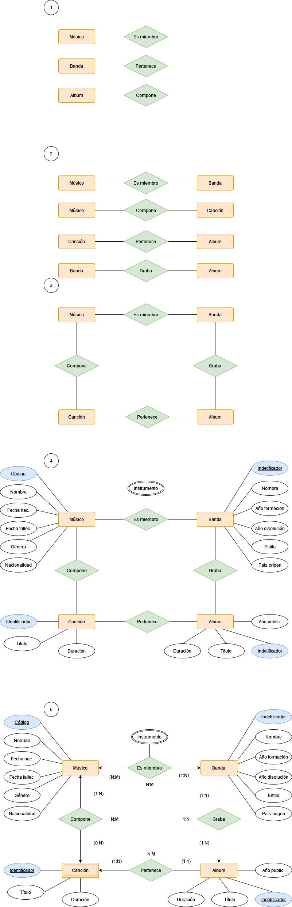

 

### Entidades

- Canción: Se tratra de una entidad débil ya que una canción (normalmente) debe pertenecer a un álbum.

### Atributos

Instrumento: Se encuentra en la relación "Es miembro" entre la entidad "Músico" y "Banda". Esto es así ya que un músico tocara un instrumento cuando este sea miembro de una banda. Además en el texto se especifica que un músico puede tocar diversos instrumentos, por lo que será multievaluado.

### Cardinalidades

- Músico-Es miembro-Banda: Un músico puede ser miembro de una o más bandas, y una banda tiene varios músicos. Cardinalidad N:M
- Banda-Graba-Album: Una banda graba entre uno y varios álbunes, mientras que un album es grabado por una única banda.
- Canción-Pertenece-Album: Una canción solo puede pertenecer a un álbum, mientras que un álbum tiene varias canciones. Cardinalidad N:M
- Músico-Compone-Canción: Un músico puede o no componer canciones, mientras que una canción debe ser compuesta por uno o varios músicos. Cardinalidad N:M

