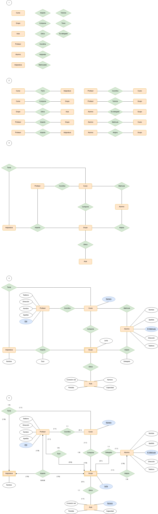

# Gestión Docente

Diseñar una Base de Datos para representar la información docente de un colegio, sabiendo que:
La formación abarca ocho cursos (1º, 2º, 3º .. 8º) en los que se imparten diversas asignaturas, tales como Matemáticas, Física, Ciencias Naturales, Sociales, Dibujo, etc., dándose el caso de algunas asignaturas de distintos cursos que tienen el mismo nombre.
Cada curso se reparte en varios grupos de alumnos a los que se asigna una letra: p.e. 3ºA, 2ºD, 5ºC, 1ºB, y se ubican en un aula fija para todo el curso. Las aulas, identificadas por un número, tienen una determinada capacidad de número de alumnos. De ellas interesa conocer, además, si disponen o no de conexión a la red de computadores del centro, y de pantalla para la proyección de transparencias.
Los profesores del centro, de los que se dispone de su nombre y apellidos, DNI, dirección y teléfono, pueden impartir varias asignaturas distintas a grupos distintos. Además, cada curso tiene un profesor coordinador y cada grupo un profesor tutor.
Acerca de los alumnos, además de su nombre y apellidos, dirección y teléfono, se desea reflejar el curso en que están matriculados y el grupo al que están asignados. También se desea representar qué alumno es el delegado de cada grupo. Como puede darse el caso, de alumnos con el mismo nombre y apellidos, cada alumno tiene asociado un (único) número de matrícula que facilita su identificación.

 

 

### Entidades y relaciones

Las entidades a destacar son:

- Asignatura: Se trata de una entidad débil ya que sin curso esta no existiria
- Grupo: Se trata de una entidad débil, ya que sin Curso esta no tendría sentido

### Atributos

- Tutor: Se encuentra en la relación "Imparte" entre las entidades "Profesor" y "Grupo". Esto es así ya que un profesor será o no tutor cuando imparta a un grupo y no antes.
- Delegado: Se encuentra en la relación "Asigna" entre las entidades "Alumno" y "Grupo". Esto es así ya que un alumno será o no delegado cuando sea asígnado a un grupo.

### Cardinalidades

- Curso-Tiene-Asignatura: Una asignatura deberá estar en un curso mientras que un curso tendrá entre una y varias asignaturas. Cardinalidad 1:N
- Profesor-Coordina-Curso: Un profesor podrá coordinar o no a un curso, mientras que un curso debe ser coordinado por un profesor. Cardinalidad 1:1
- Curso-Compone-Grupo: Un curso se va a componer de entre un y varios grupos, mientras que un grupo solo va a componer a un curso. Cardinalidad 1:N
- Alumno-Matricula-Curso: Un alumno se matricula en un único curso, mientras que en un curso se matricula entre uno y varios alumnos. Cardinalidad 1:N
- Alumno-Asigna-Grupo: A un alumno se le asigna un único grupo, mientras que un grupo tiene entre uno y varios alumnos. Cardinalidad 1:N
- Grupo-Ubica-Aula: Un grupo se va a ubicar en una única aula y en un aula solo se puede o no ubicar un único grupo. Cardinalidad 1:1
- Profesor-Imparte-Asignatura-Grupo: Un profesor imparte una o varias asignaturas a uno o varios grupos, así como una asignatura puede ser impartida en uno o varios grupos y por uno o varios profesores. Cardinalidad N:N:M
