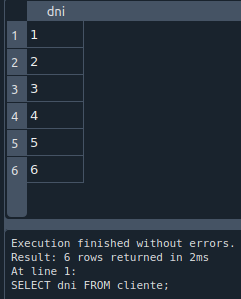
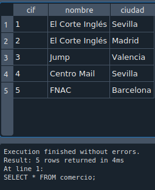

# Consultas SQL

- Realiza las siguientes consultas:
  
  - 1. Averigua el DNI de todos los clientes. 

            SELECT dni FROM cliente; 

  - 2. Consulta todos los datos de todos los programas. 

            SELECT * FROM programa; 

  - 3. Obtén un listado con los nombres de todos los programas. 

            SELECT nombre FROM programa;

  - 4. Genera una lista con todos los comercios. 

            SELECT * FROM comercio; 

  - 5. Genera una lista de las ciudades con establecimientos donde se venden programas, sin que aparezcan valores duplicados (utiliza DISTINCT). 
          
          SELECT DISTINC nombre FROM comercio; 

  - 6. Obtén una lista con los nombres de programas, sin que aparezcan valores duplicados (utiliza DISTINCT). 
  - 7. Obtén el DNI más 4 de todos los clientes.  
  - 8. Haz un listado con los códigos de los programas multiplicados por 7. 9 ¿Cuáles son los programas cuyo código es inferior o igual a 10? 
  - 10. ¿Cuál es el programa cuyo código es 11? 
  - 11. ¿Qué fabricantes son de Estados Unidos? 
  - 12. ¿Cuáles son los fabricantes no españoles? Utilizar el operador IN. 
  - 13. Obtén un listado con los códigos de las distintas versiones de Windows. 
  - 14. ¿En qué ciudades comercializa programas El Corte Inglés? 
  - 15. ¿Qué otros comercios hay, además de El Corte Inglés? Utilizar el operador IN. 
  - 16. Genera una lista con los códigos de las distintas versiones de Windows y Access. Utilizar el operador IN. 
  - 17. Obtén un listado que incluya los nombres de los clientes de edades comprendidas entre 10 y 25 y de los mayores de 50 años. Da una solución con BETWEEN y otra sin BETWEEN.
  - 18. Saca un listado con los comercios de Sevilla y Madrid. No se admiten valores duplicados. 
  - 19. ¿Qué clientes terminan su nombre en la letra “o”? 
  - 20. ¿Qué clientes terminan su nombre en la letra “o” y, además, son mayores de 30 años? 
  - 21. Obtén un listado en el que aparezcan los programas cuya versión finalice por una letra i, o cuyo nombre comience por una A o por una W. 
  - 22. Obtén un listado en el que aparezcan los programas cuya versión finalice por una letra i, o cuyo nombre comience por una A y termine por una S. 
  - 23. Obtén un listado en el que aparezcan los programas cuya versión finalice por una letra i, y cuyo nombre no comience por una A. 
  - 24. Obtén una lista de empresas por orden alfabético ascendente. 
  - 25. Genera un listado de empresas por orden alfabético descendente. 
  - 26. Obtén un listado de programas por orden de versión.
  - 27. Genera un listado de los programas que desarrolla Oracle. 
  - 28. ¿Qué comercios distribuyen Windows? 
  - 29. Genera un listado de los programas y cantidades que se han distribuido a El Corte Inglés de Madrid. 
  - 30. ¿Qué fabricante ha desarrollado Freddy Hardest? 
  - 31. Selecciona el nombre de los programas que se registran por Internet. 
  - 32. ¿Qué medios ha utilizado para registrarse Pepe Pérez? 
  - 33. ¿Qué usuarios han optado por Internet como medio de registro? 
  - 34. ¿Qué programas han recibido registros por tarjeta postal? 
  - 35. ¿En qué localidades se han vendido productos que se han registrado por Internet? 
  - 36. Obtén un listado de los nombres de las personas que se han registrado por Internet, junto al nombre de los programas para los que ha efectuado el registro. 
  - 37. Genera un listado en el que aparezca cada cliente junto al programa que ha registrado, el medio con el que lo ha hecho y el comercio en el que lo ha adquirido.
  - 38. Genera un listado con las ciudades en las que se pueden obtener los productos de Oracle. 
  - 39. Obtén el nombre de los usuarios que han registrado Access XP. 
  - 40. Nombre de aquellos fabricantes cuyo país es el mismo que ʻOracleʼ. (Subconsulta). 
  - 41. Nombre de aquellos clientes que tienen la misma edad que Pepe Pérez. (Subconsulta). 
  - 42. Genera un listado con los comercios que tienen su sede en la misma ciudad que tiene el comercio ʻFNACʼ. (Subconsulta). 
  - 43. Nombre de aquellos clientes que han registrado un producto de la misma forma que el cliente ʻPepe Pérezʼ. (Subconsulta). 
  - 44. Obtener el número de programas que hay en la tabla programas. 46 Calcula el número de clientes cuya edad es mayor de 40 años. 
  - 45. Calcula el número de productos que ha vendido el establecimiento cuyo CIF es 1. 
  - 46. Calcula la media de programas que se venden cuyo código es 7.  
  - 47. Calcula la mínima cantidad de programas de código 7 que se ha vendido 
  - 48. Calcula la máxima cantidad de programas de código 7 que se ha vendido.
  - 49. ¿En cuántos establecimientos se vende el programa cuyo código es 7? 
  - 50. Calcular el número de registros que se han realizado por Internet.  
  - 51. Obtener el número total de programas que se han vendido en ʻSevillaʼ. 
  - 52. Calcular el número total de programas que han desarrollado los fabricantes cuyo país es ʻEstados Unidosʼ. 
  - 53. Visualiza el nombre de todos los clientes en mayúscula. En el resultado de la consulta debe aparecer también la longitud de la cadena nombre. 
  - 54. Con una consulta concatena los campos nombre y versión de la tabla PROGRAMA.   

