# Consultas SQL

- Realiza las siguientes consultas:
  
- 1. Averigua el DNI de todos los clientes.

            SELECT dni FROM cliente; 

- 2. Consulta todos los datos de todos los programas.

            SELECT * FROM programa; 

- 3. Obtén un listado con los nombres de todos los programas.

            SELECT nombre FROM programa;

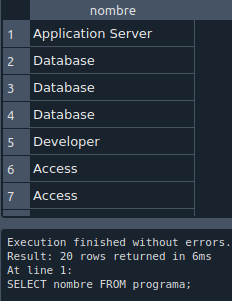

- 4. Genera una lista con todos los comercios.

            SELECT * FROM comercio; 

- 5. Genera una lista de las ciudades con establecimientos donde se venden programas, sin que aparezcan valores duplicados (utiliza DISTINCT).

          SELECT DISTINC nombre FROM comercio;

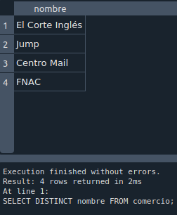

- 6. Obtén una lista con los nombres de programas, sin que aparezcan valores duplicados (utiliza DISTINCT).

            SELECT DISTINC nombre FROM programa; 
  
  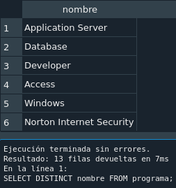

- 7. Obtén el DNI más 4 de todos los clientes.

            SELECT dni+4 FROM cliente;
  
  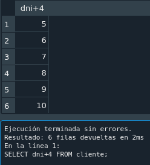

- 8. Haz un listado con los códigos de los programas multiplicados por 7.
  
            SELECT codigo*7 FROM programa; 
  
  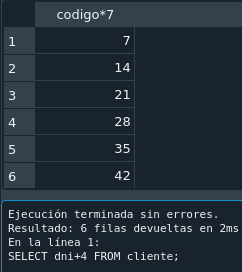

- 9. ¿Cuáles son los programas cuyo código es inferior o igual a 10?

            SELECT * FROM programa WHERE codigo<=10; 
            %Este está mal%

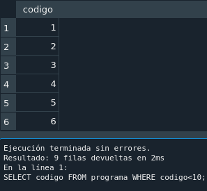

- 10. ¿Cuál es el programa cuyo código es 11?

            SELECT * FROM programa WHERE codigo=11;

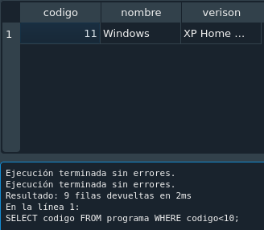

- 11. ¿Qué fabricantes son de Estados Unidos?

           SELECT * FROM fabricante where pais="Estados Unidos";

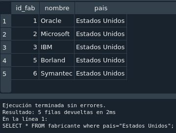

- 12. ¿Cuáles son los fabricantes no españoles? Utilizar el operador IN.

            SELECT * FROM fabricante WHERE pais NOT IN ("España");

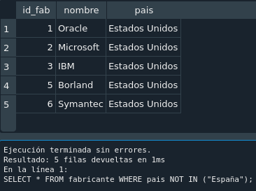

- 13. Obtén un listado con los códigos de las distintas versiones de Windows.

            SELECT codigo,verison FROM programa WHERE nombre="Windows";

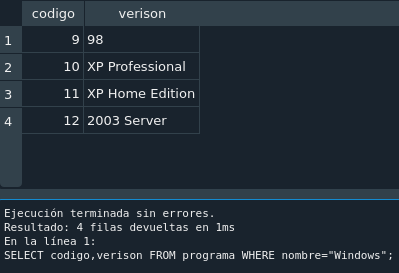

- 14. ¿En qué ciudades comercializa programas El Corte Inglés?

            SELECT ciudad FROM comercio WHERE nombre="El Corte Inglés";

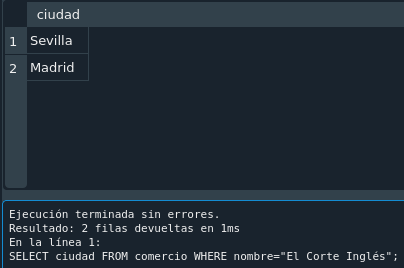

- 15. ¿Qué otros comercios hay, además de El Corte Inglés? Utilizar el operador IN.

          SELECT nombre FROM comercio WHERE nombre NOT IN ("El Corte Inglés");

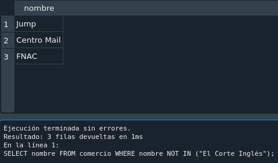

- 16. Genera una lista con los códigos de las distintas versiones de Windows y Access. Utilizar el operador IN.

          SELECT * FROM programa WHERE nombre IN ("Windows","Access");

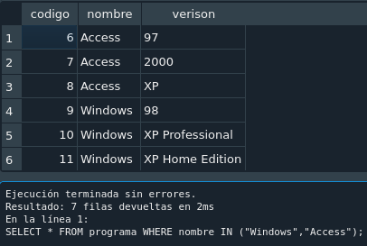

- 17. Obtén un listado que incluya los nombres de los clientes de edades comprendidas entre 10 y 25 y de los mayores de 50 años. Da una solución con BETWEEN y otra sin BETWEEN.

          SELECT nombre,edad FROM cliente WHERE (edad>=10 AND edad<=25) OR edad>50;

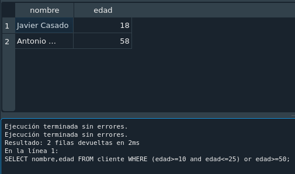

          SELECT nombre,edad FROM cliente WHERE edad BETWEEN 10 AND 25 OR edad>50;

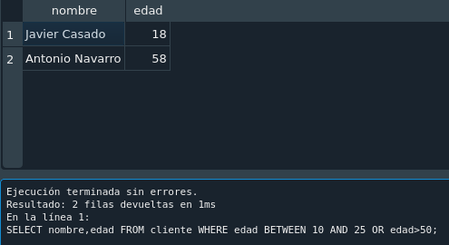

- 18. Saca un listado con los comercios de Sevilla y Madrid. No se admiten valores duplicados.

          SELECT DISTINCT nombre FROM comercio WHERE ciudad="Madrid" or ciudad="Sevilla";

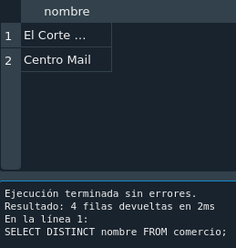

- 19. ¿Qué clientes terminan su nombre en la letra “o”?

          SELECT nombre FROM cliente WHERE nombre REGEXP "o$";

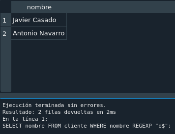

- 20. ¿Qué clientes terminan su nombre en la letra “o” y, además, son mayores de 30 años?

          SELECT nombre,edad FROM cliente WHERE nombre REGEXP "o$" and edad>30;

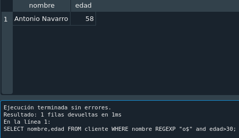

- 21. Obtén un listado en el que aparezcan los programas cuya versión 
finalice por una letra i, o cuyo nombre comience por una A o por una W.

          SELECT nombre,verison FROM programa WHERE verison REGEXP "i$" OR nombre REGEXP "^[AW]";

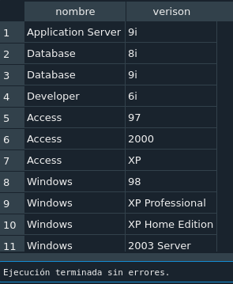

- 22. Obtén un listado en el que aparezcan los programas cuya versión finalice por una letra i, o cuyo nombre comience por una A y termine por una S.

          SELECT nombre,verison FROM programa WHERE verison  REGEXP "i$" OR nombre REGEXP "^A" or "s$";

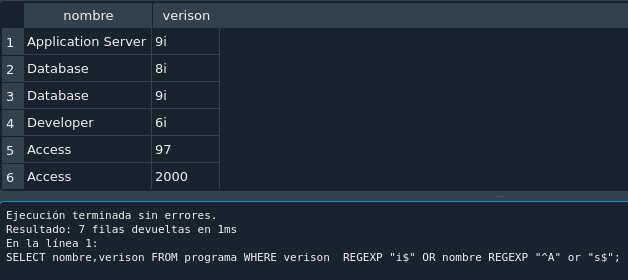

- 23. Obtén un listado en el que aparezcan los programas cuya versión finalice por una letra i, y cuyo nombre no comience por una A.

          SELECT nombre,verison FROM programa WHERE verison REGEXP "i$" AND  nombre NOT REGEXP "^A";

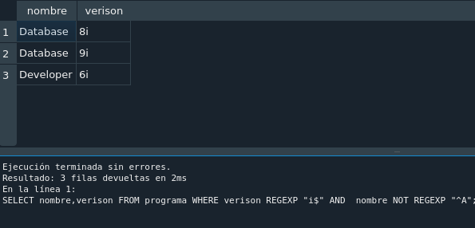

- 24. Obtén una lista de empresas por orden alfabético ascendente.

          SELECT DISTINCT nombre FROM comercio ORDER BY nombre;

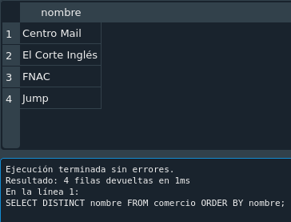

- 25. Genera un listado de empresas por orden alfabético descendente.

          SELECT DISTINCT nombre FROM comercio ORDER BY nombre DESC;

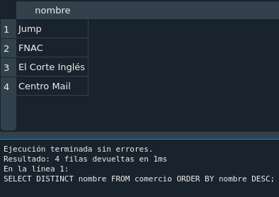

- 26. Obtén un listado de programas por orden de versión.

          SELECT nombre,verison FROM programa ORDER BY verison;

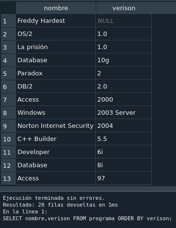

- 27. Genera un listado de los programas que desarrolla Oracle.

          SELECT DISTINCT programa.nombre FROM programa JOIN desarrolla ON programa.codigo=desarrolla.id_fab JOIN  fabricante ON desarrolla.id_fab=fabricante.id_fab WHERE fabricante.nombre="Oracle";

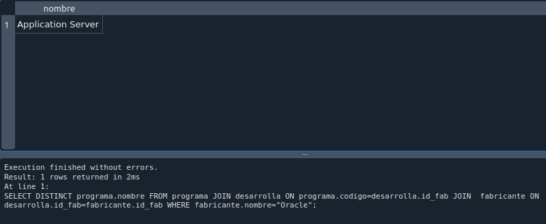

- 28. ¿Qué comercios distribuyen Windows?

          SELECT comercio.nombre FROM comercio JOIN distribuye ON comercio.cif=distribuye.cif JOIN programa ON distribuye.codigo=programa.codigo WHERE programa.nombre="Windows"; 

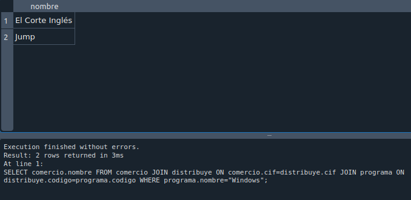

- 29. Genera un listado de los programas y cantidades que se han distribuido a El Corte Inglés de Madrid.

          SELECT programa.nombre,distribuye.cantidad FROM programa JOIN distribuye ON programa.codigo=distribuye.codigo JOIN comercio ON distribuye.cif=comercio.cif WHERE comercio.nombre="El Corte Inglés" and comercio.ciudad="Madrid";

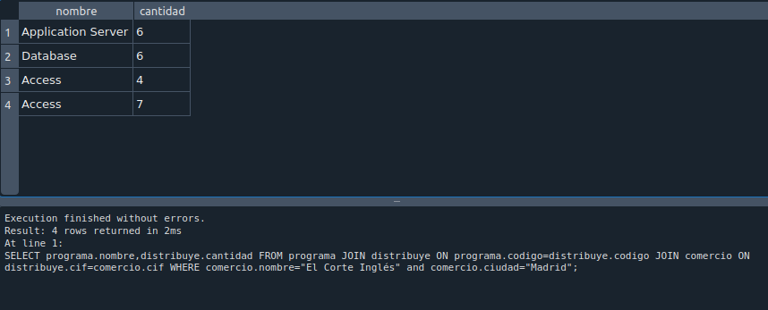

- 30. ¿Qué fabricante ha desarrollado Freddy Hardest?

          SELECT fabricante.nombre FROM fabricante JOIN desarrolla ON fabricante.id_fab=desarrolla.id_fab JOIN programa ON programa.codigo=desarrolla.codigo WHERE programa.nombre="Freddy Hardest";

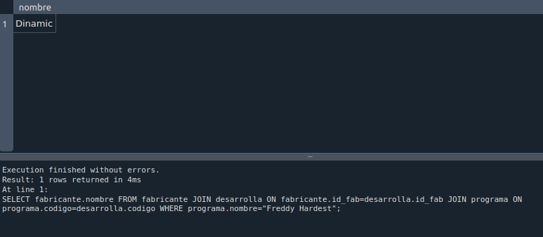

- 31. Selecciona el nombre de los programas que se registran por Internet.

        SELECT programa.nombre FROM programa JOIN registra ON programa.codigo=registra.codigo WHERE registra.medio="Internet";

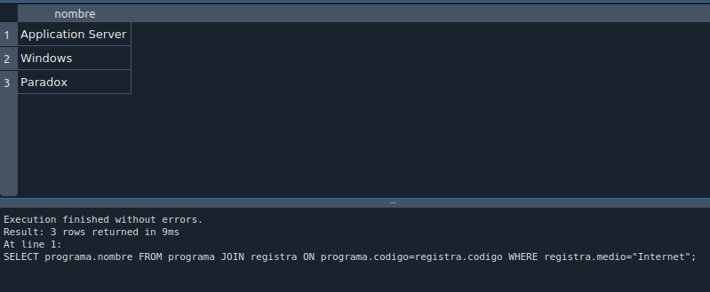

- 32. ¿Qué medios ha utilizado para registrarse Pepe Pérez?

        SELECT registra.medio FROM registra JOIN cliente ON registra.dni=cliente.dni WHERE cliente.nombre="Pepe Pérez"

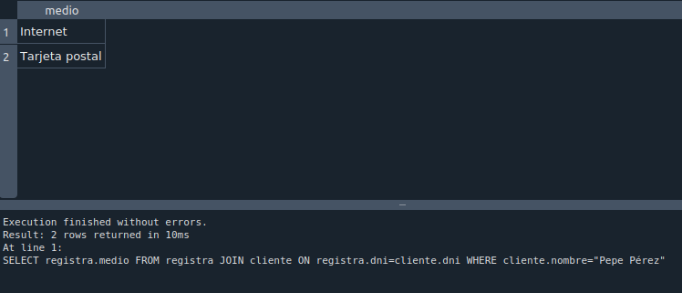

- 33. ¿Qué usuarios han optado por Internet como medio de registro?

          SELECT cliente.nombre FROM cliente JOIN registra ON cliente.dni=registra.dni WHERE registra.medio="Internet"

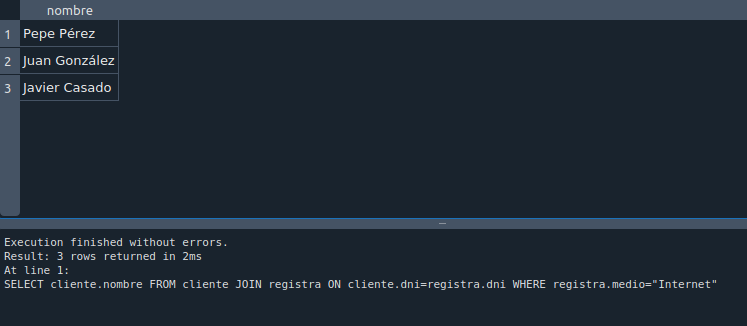

- 34. ¿Qué programas han recibido registros por tarjeta postal?

          SELECT programa.nombre FROM programa JOIN registra ON programa.codigo=registra.codigo WHERE registra.medio="Tarjeta postal"

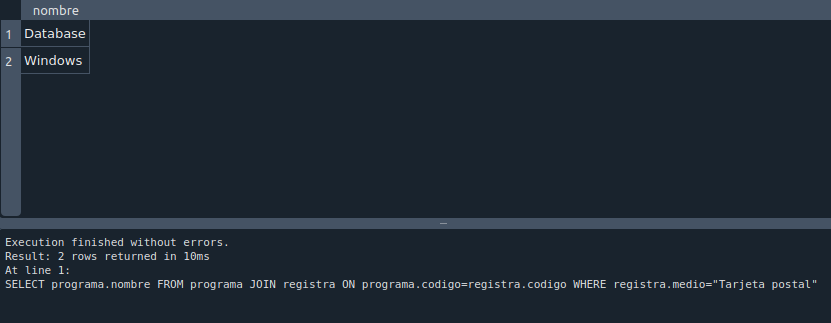

- 35. ¿En qué localidades se han vendido productos que se han registrado por Internet?

          SELECT comercio.ciudad FROM comercio JOIN registra ON comercio.cif=registra.cif WHERE registra.medio="Internet"

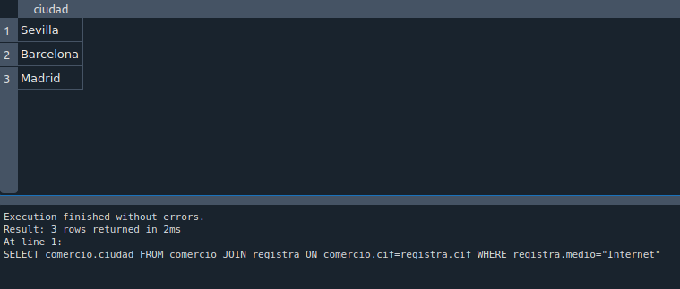

- 36. Obtén un listado de los nombres de las personas que se han registrado por Internet, junto al nombre de los programas para los que ha efectuado el registro.

          SELECT cliente.nombre,programa.nombre FROM cliente JOIN registra ON cliente.dni=registra.dni JOIN programa ON programa.codigo=registra.codigo WHERE registra.medio="Internet"

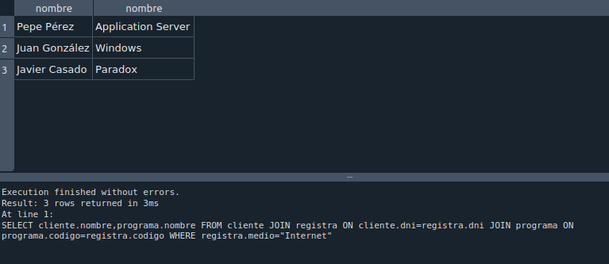

- 37. Genera un listado en el que aparezca cada cliente junto al programa que ha registrado, el medio con el que lo ha hecho y el comercio en el que lo ha adquirido.

          SELECT cliente.nombre, programa.nombre, registra.medio FROM cliente JOIN registra ON cliente.dni=registra.dni JOIN programa ON programa.codigo=registra.codigo;

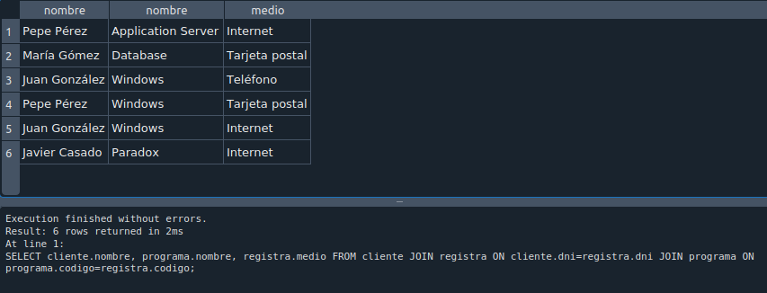

- 38. Genera un listado con las ciudades en las que se pueden obtener los productos de Oracle.

          SELECT DISTINCT t1.ciudad FROM comercio as t1 JOIN distribuye as t2 ON t1.cif=t2.cif JOIN programa as t3 ON t2.codigo=t3.codigo JOIN desarrolla as t4 ON t3.codigo=t4.codigo JOIN fabricante;

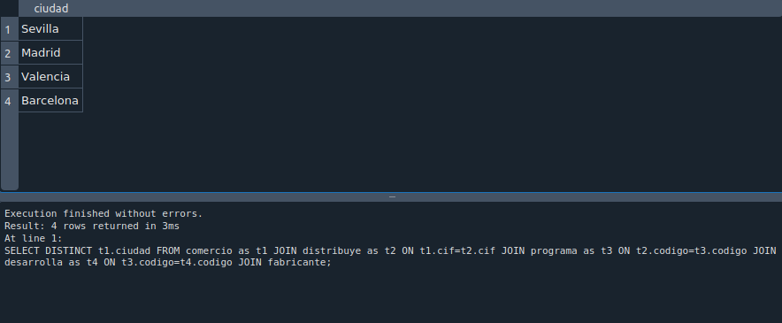

- 39. Obtén el nombre de los usuarios que han registrado Access XP.

          SELECT cliente.nombre FROM cliente JOIN registra ON cliente.dni=registra.dni JOIN programa ON programa.codigo=registra.codigo WHERE programa.nombre="Access" programa.verison="XP";

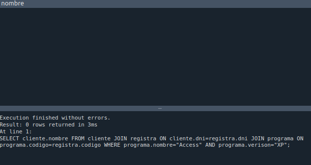

- 40. Nombre de aquellos fabricantes cuyo país es el mismo que ʻOracleʼ. (Subconsulta).

                SELECT nombre FROM fabricante WHERE pais in (SELECT pais FROM fabricante WHERE nombre="Oracle");

- 41. Nombre de aquellos clientes que tienen la misma edad que Pepe Pérez. (Subconsulta).

                SELECT nombre FROM cliente WHERE edad in (SELECT edad FROM cliente WHERE nombre="Pepe Pérez");

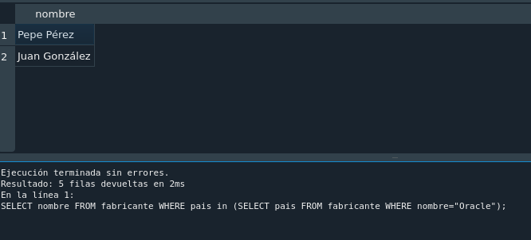

- 42. Genera un listado con los comercios que tienen su sede en la misma ciudad que tiene el comercio ʻFNACʼ. (Subconsulta).

                SELECT nombre FROM comercio WHERE ciudad in (SELECT ciudad FROM comercio WHERE nombre="FNAC");

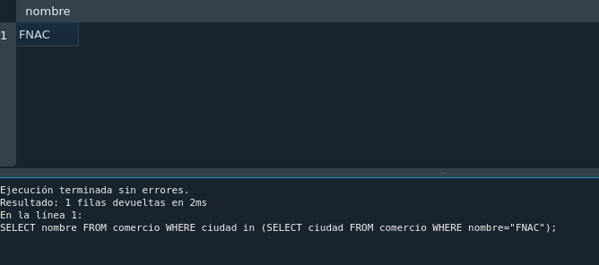

- 43. Nombre de aquellos clientes que han registrado un producto de la misma forma que el cliente ʻPepe Pérezʼ. (Subconsulta).

                SELECT DISTINCT nombre FROM cliente JOIN registra ON cliente.dni=registra.dni WHERE registra.medio in (SELECT registra.medio FROM registra JOIN cliente ON cliente.dni=registra.dni WHERE cliente.nombre="Pepe Pérez");

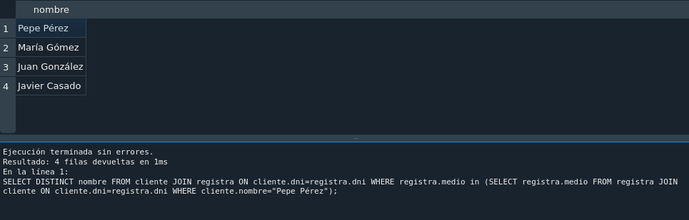

- 44. Obtener el número de programas que hay en la tabla programas. 
                SELECT count(codigo) FROM programa;

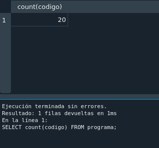

- 45. Calcula el número de clientes cuya edad es mayor de 40 años.

                SELECT count(dni) FROM cliente WHERE edad > 40;

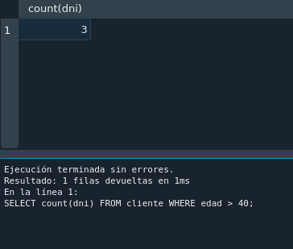

- 46. Calcula el número de productos que ha vendido el establecimiento cuyo CIF es 1.

                SELECT sum(cantidad) FROM distribuye WHERE cif=1;

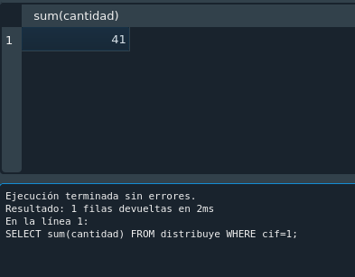

- 47. Calcula la media de programas que se venden cuyo código es 7.  

                SELECT avg(cantidad) FROM distribuye WHERE codigo=7;

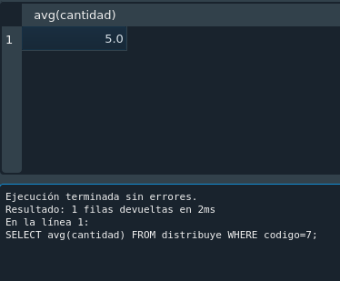

- 48. Calcula la mínima cantidad de programas de código 7 que se ha vendido

                SELECT min(cantidad) FROM distribuye WHERE codigo=7;

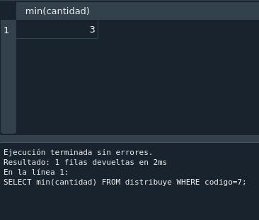

- 49. Calcula la máxima cantidad de programas de código 7 que se ha vendido.

                SELECT max(cantidad) FROM distribuye WHERE codigo=7;

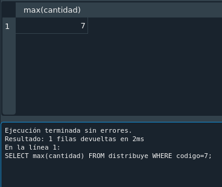

- 50. ¿En cuántos establecimientos se vende el programa cuyo código es 7?

                SELECT count(cif) FROM distribuye WHERE codigo=7;

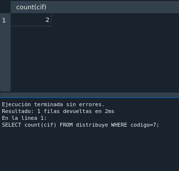

- 51. Calcular el número de registros que se han realizado por Internet.  

                SELECT count(dni) FROM registra WHERE medio="Internet";

- 52. Obtener el número total de programas que se han vendido en ʻSevillaʼ.

                SELECT sum(cantidad) FROM distribuye, comercio WHERE distribuye.cif = comercio.cif AND comercio.ciudad="Sevilla";

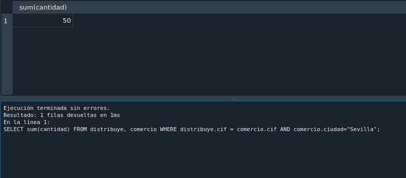

- 53. Calcular el número total de programas que han desarrollado los fabricantes cuyo país es ʻEstados Unidosʼ.

                SELECT count(codigo) FROM desarrolla, fabricante WHERE fabricante.id_fab=desarrolla.id_fab AND fabricante.pais="Estados Unidos";

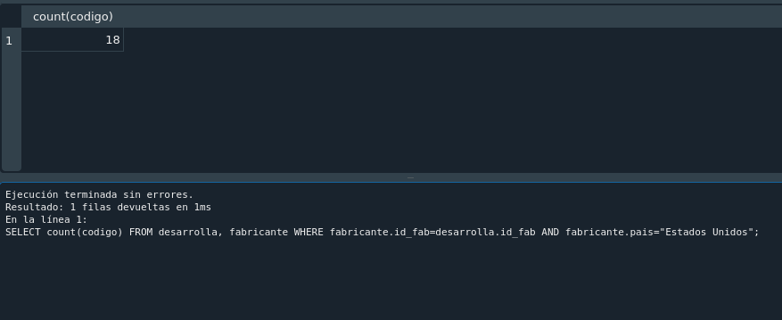

- 54. Visualiza el nombre de todos los clientes en mayúscula. En el resultado de la consulta debe aparecer también la longitud de la cadena nombre.

                SELECT UPPER(nombre), LENGTH(nombre) FROM cliente;

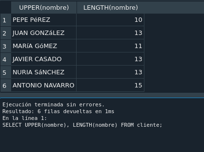

- 55. Con una consulta concatena los campos nombre y versión de la tabla PROGRAMA.

              SELECT nombre || " " || verison FROM programa;  

