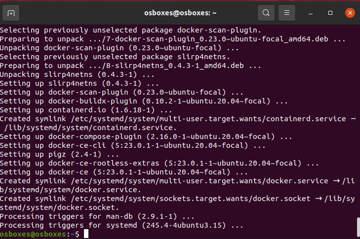
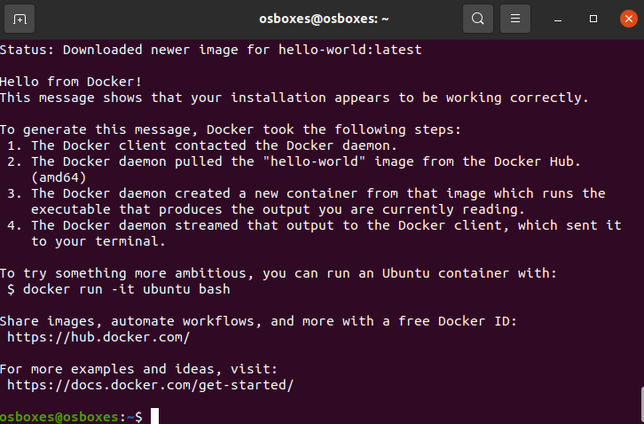
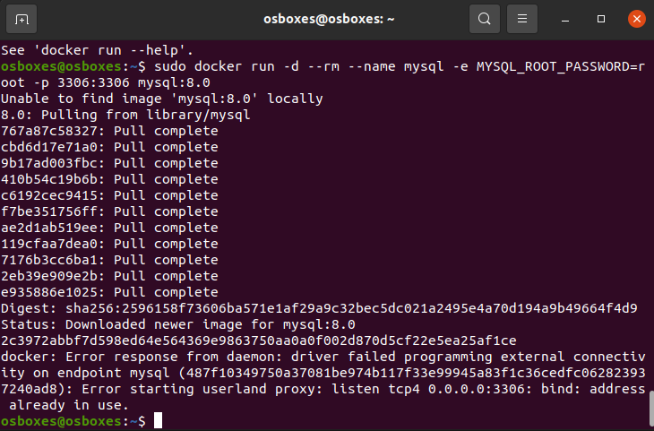
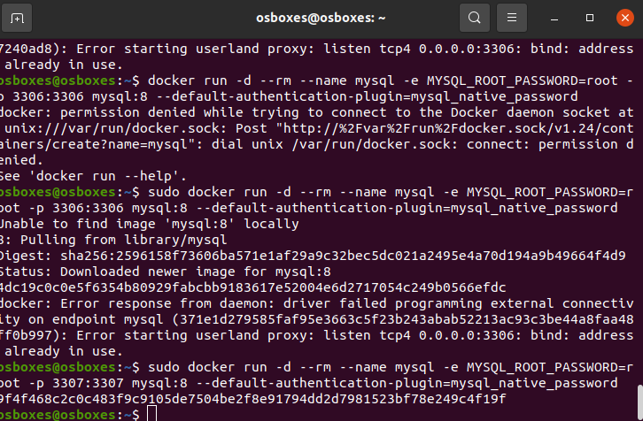
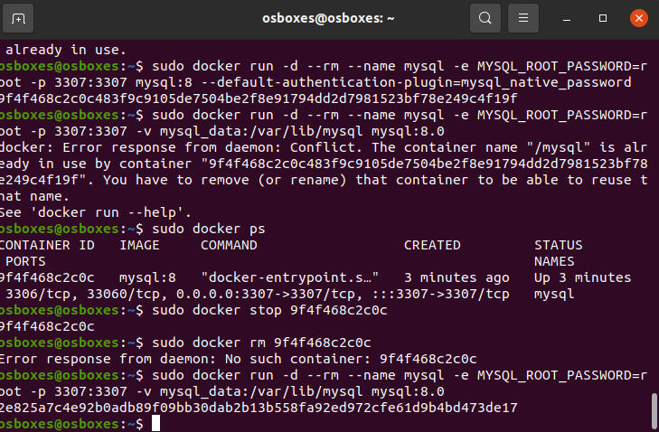

# Instalación de Contenedor Docker con MySQL

## Instalación de Docker

Antes de emepzar deberemos de instalar Docker. Para ello sera tan simple como:

- Eliminamos versiones anteriores si tenemos

    sudo apt-get remove docker docker-engine docker.io containerd runc

- Instalamos por medio del repositorio

    sudo apt-get update
    sudo apt-get install \
    ca-certificates \
    curl \
    gnupg \
    lsb-release

- Seguidamente utilizamos el siguiente comando

    sudo mkdir -m 0755 -p /etc/apt/keyrings
    curl -fsSL https://download.docker.com/linux/ubuntu/gpg | sudo gpg --dearmor -o /etc/apt/keyrings/docker.gpg

- Por último 

    echo \
    "deb [arch=$(dpkg --print-architecture) signed-by=/etc/apt/keyrings/docker.gpg] https://download.docker.com/linux/ubuntu \
    $(lsb_release -cs) stable" | sudo tee /etc/apt/sources.list.d/docker.list > /dev/null

A continuación instalamos Docker Engine

    sudo apt-get update

    sudo apt-get install docker-ce docker-ce-cli containerd.io docker-buildx-plugin docker-compose-plugin

Para verificar que todo se ha instalado correctamente instalaremos la imagen de hello-world:

    sudo docker run hello-world

## Instalación de MySQL

Para la creación de un contenedor sin persisntencia de datos haremos lo siguiente: 

    sudo docker run -d --rm --name mysql -e MYSQL_ROOT_PASSWORD=root -p 3306:3306 mysql:8.0

Para cambiar el plugin de autenticación en las versiones superiores a la 8.0 haríamos lo siguiente: 

    sudo docker run -d --rm --name mysql -e MYSQL_ROOT_PASSWORD=root -p 3306:3306 mysql:8 --default-authentication-plugin=mysql_native_password

Si nos encontramos con que el puerto ya está en uso, basta con cambiar el servicio que esta utilizando dicho puerto o cambiar el puerto especificado por otro.

Para la creación de un contendor con persistencia de datos deberemos de crear un volumen. Para ello: 

    sudo docker run -d --rm --name mysql -e MYSQL_ROOT_PASSWORD=root -p 3307:3307 -v mysql_data:/var/lib/mysql mysql:8.0

*Como hemos realizado el paso anterior para la creación de contenedor sin persistencia, habrá que parar el contenedor con:

    sudo docker stop idservicio

Para comprobar que el contenedor está en ejecución basta con utilizar 

    docker ps

## Ejemplo de docker-compose.yml con MySQL Server

Docker Compose permite gestionar diversos contenedores de Docker, para lo cual se utilizan archivos YAML, donde se definen las configuraciones de los servicios.

Para ello creamos un ifichero .yml con el siguiente contenido : 

    version: '3'

    services:
    mysql:
        image: mysql:8.0
        ports:
        - 3306:3306
        environment:
        - MYSQL_ROOT_PASSWORD=root
        - MYSQL_DATABASE=database
        - MYSQL_USER=user
        - MYSQL_PASSWORD=password
        volumes:
        - mysql_data:/var/lib/mysql

    volumes:
    mysql_data:

A continuación lanzamos el siguiente comando en la misma ruta donde tenemos el fichero yaml.

    docker-compose up -d

Una vez hecho esto, para detener el servicio y mantener el volumen ejecutamos: 

    docker-compose down

