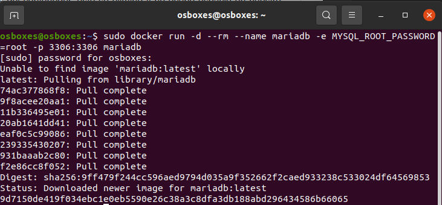
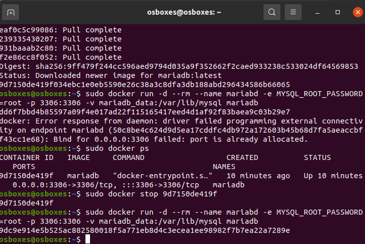
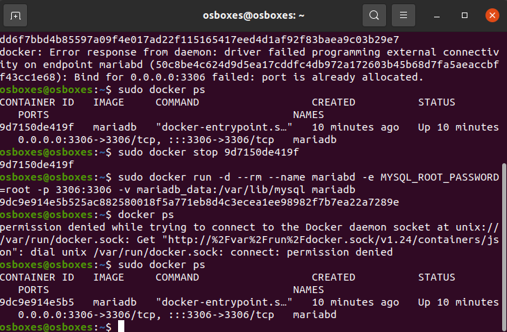

# Creación de un contenedor Docker con MariaDB

## Creación de un contenedor sin persistencia de datos

Para lanzas un contenedor Docker con MariaDB sin persistencia de datos utilizaremos el siguiente comando: 

    docker run -d --rm --name mariadb -e MYSQL_ROOT_PASSWORD=root -p 3306:3306 mariadb

## Creación de un contenedor con persistencia de datos

Para lanzar un contenedor Docker con Maria DB con persistencia de datos en un volumen se podría usar el siguiente comando: 

    docker run -d --rm --name mariabd -e MYSQL_ROOT_PASSWORD=root -p 3306:3306 -v mariadb_data:/var/lib/mysql mariadb

Para comprobar que el contenedor está en ejecución usaremos el comando:

        docker ps

