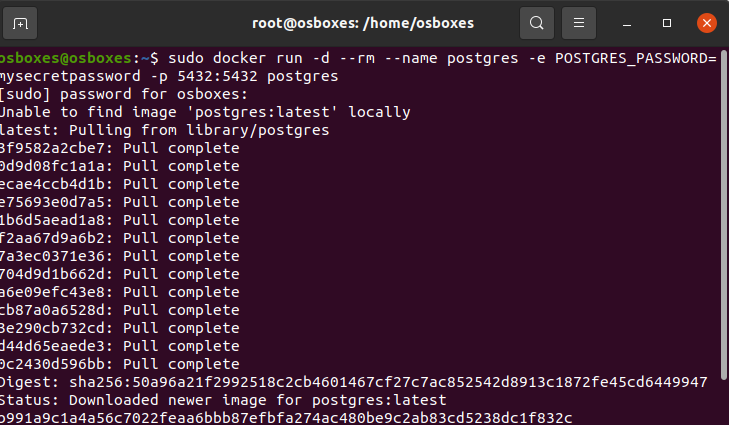
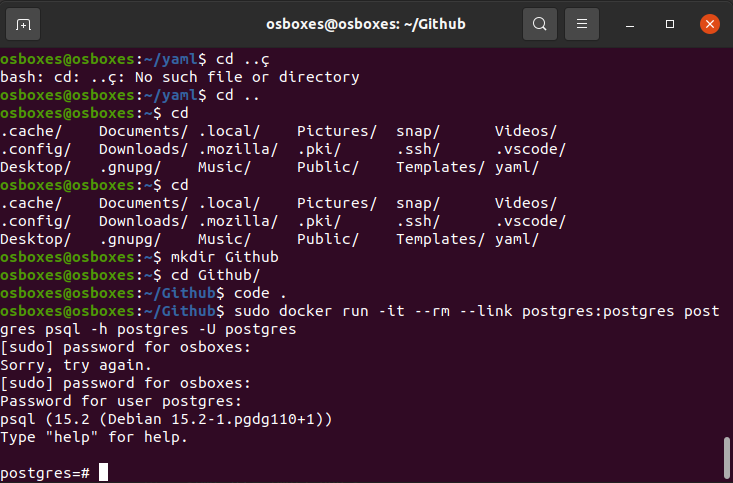
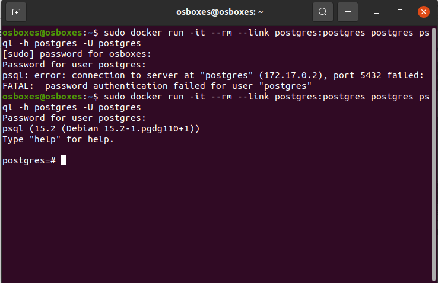
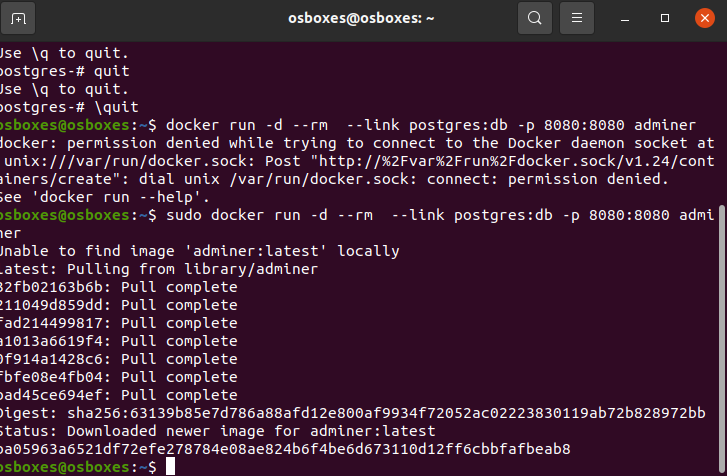

# Creación de un contenedor Docker con PostgreSQL

## Creación de un contendor sin persistencia

Para lanzar un contenedor Docker con PostgreSQL sin persistencia: 

    sudo docker run -d --rm --name postgres -e POSTGRES_PASSWORD=mysecretpassword -p 5432:5432 postgres

## Conectarse ejecutando PostgreSQL usando psql

Para utilizar la herramienta psql

    sudo docker run -it --rm --link postgres:postgres postgres psql -h postgres -U postgres

## Conectar el conectenedor que está ejecutando PostgreSQL usando psql

Para conectarnos a PostgresSQL utilizando la herramiento psql: 

    sudo docker run -it --rm --link postgres:postgres postgres psql -h postgres -U postgres

## Conectarse con el contenedor que está ejecutando PostrgreSQL usando adminer

A través del siguiente comando se puede crear un contenedor Adminer para utilizar una interfasz web que nos permite conectar con PostgreSQL

    sudo docker run -d --rm  --link postgres:db -p 8080:8080 adminer

