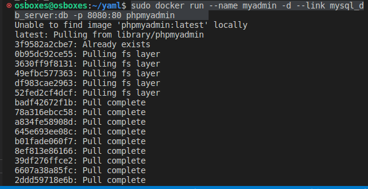
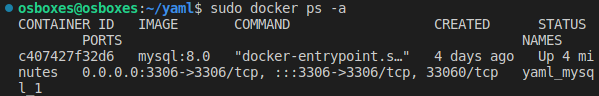
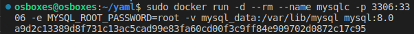
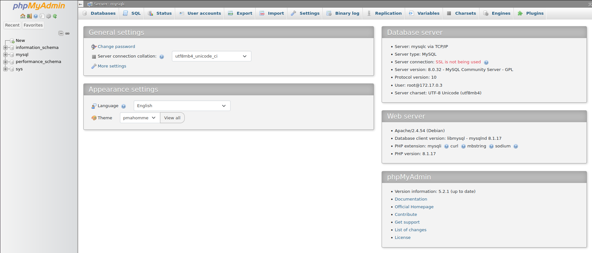
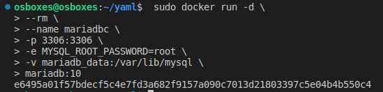
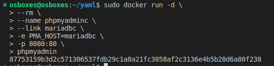

<div align="center">

# Creación de un contenedor Docker con phpMyAdmin

</div>

<div align="justify">

## Enlazar un contenedor Docker con MySQL o MariaDB

Para la instalación se utilizará una imagen oficial de phpmyadmin:

    sudo docker run --name myadmin -d --link mysql_db_server:db -p 8080:80 phpmyadmin

<div align="center">



</div>

Para comprobar que contenedores tenemos activos en este momento: 

    sudo docker ps -a


<div align="center">



</div>

A continuación deberemos de parar y eliminar el contenedor para evitar problemas en las siguientes partes.

Una vez hecho esto lanzamos un contenedor docker de MySQL:

        docker run -d \
    --rm \
    --name mysqlc \
    -p 3306:3306 \
    -e MYSQL_ROOT_PASSWORD=root \
    -v mysql_data:/var/lib/mysql \
    mysql:8.0
    ```

<div align="center">



</div>

Una vez que la insta de MySQL está en ejecución podemos crear el contenedor con phpMyAdmin:

    sudo docker run -d \
    --rm \
    --name phpmyadminc \
    --link mysqlc \
    -e PMA_HOST=mysqlc \
    -p 8080:80 \
    phpmyadmin

Una vez hecho esto, se puede comprobar si se ha realizado todo correctamente en el siguiente enlace http://localhost:8080. En este caso, el usuario y contraseña seran "root".

<div align="center">



</div>

## Uso con MariaDB y phpMyAdmin

Para la creación de un contenedor con MariaDB con persistencia de datos: 

     sudo docker run -d \
    --rm \
    --name mariadbc \
    -p 3306:3306 \
    -e MYSQL_ROOT_PASSWORD=root \
    -v mariadb_data:/var/lib/mariadb \
    mariadb:10

<div align="center">



</div>

Conectamos el contenedor phpMyAdmin con el contenedor anterior

    sudo docker run -d \
    --rm \
    --name phpmyadminc \
    --link mariadbc \
    -e PMA_HOST=mariadbc \
    -p 8080:80 \
    phpmyadmin




</div>